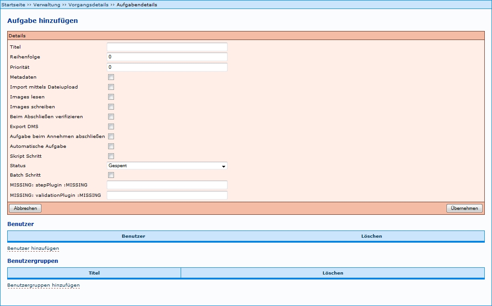
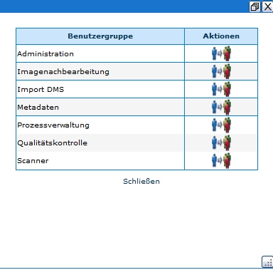

# Einleitung

Unter den [Vorgangsdetails](Vorgangsdetails) einer [Produktionsvorlage](Vorgangsdetails) ist als zweiter Schritt die Abfolge der [Aufgaben](Aufgaben) (Workflow) festzulegen. Das Beispiel zeigt unter _Abfolge der Aufgaben_ einen bereits definierten Workflow mit folgenden Angaben:

* Nummer, die die Reihenfolge des Arbeitsschrittes ausweist;
* Titel (Benennung) des Arbeitsschrittes - verbale Formulierung frei wählbar, sollte jedoch innerhalb eines Anwendersystems für ein und denselben Sachverhalt konstant verwendet werden;
* Status der Bearbeitung;
* Auswahl möglicher Aktionen über den Button  zur Weiterleitung zu Details der Aufgabe;
* Per Mausklick auf den Titel des Arbeitsschrittes erscheinen weitere Eigenschaften, etwa zu Priorität des Schrittes und Stand der Aktualisierung der Detailangaben.

Über den Link _Aufgabe hinzufügen_ im unteren Bereich der Übersicht öffnet sich das entsprechende Formular (Funktionsbeschreibung siehe unten).

Beispiel:

# Aufgabe hinzufügen

Für das Anlegen einer neuen Aufgabe stehen mehrere Arbeitsschritte zur Verfügung:

Angaben zu _Details_ der Aufgabe ist verbindlich. Das Hinzufügen der Benutzergruppe darf nicht vergessen werden, da ansonsten die Aufgabe nicht unter _Meine Aufgaben_ des jeweiligen Bearbeiters aufgeführt wird. Das Hinzufügen einzelner Benutzer bildet dann eine zusätzliche Option, die jedoch nur in Ausnahmefälle genutzt werden sollte, da die Verwaltung über Benutzergruppen viel Aufwand erspart und übersichtlicher ist. Alle Schritte wwerden im Folgenden genauer erläutert. 

## 1 Details einer Aufgabe festlegen

Siehe hier als Beispiel [Aufgaben Einstellungen](Aufgaben-Einstellungen)

Allgemeine Beschreibung der Details:

| Details | Beschreibung |
| ------------- | ------------- |
| Titel | verbale Benennung der Aufgabe - sollte für ein und dieselbe Tätigkeit stets identisch benannt werden |
| Reihenfolge | Die Ziffer gibt an, in welcher Reihenfolge die Aufgaben bearbeitet werden sollen. |
| Priorität | Vergabe einer Zahl zwischen 1 und 3, die eine Priorität angibt. Die Priorität hat keine systemabhängige qualitative Auswirkung. Sie dient lediglich der Mitarbeiterinformation. |
| Metadaten | Diese Einstellung bewirkt, dass bei Annahme des entsprechenden Schrittes der Metadateneditor gestartet wird. _Empfehlung_: Vergabe für alle Aufgaben, die mit der Bearbeitung von Metadaten zu tun haben (z.B. Erfassen der Meta- und Strukturdaten etc.) |
| Import mittels Dateiupload | ??? |
| Images lesen | Es wird ein Benutzerverzeichnis angelegt, welches es ermöglicht Bilder auszulesen. Der Ordner, in dem die Bilder liegen, wird nach dem Vorgang und der Vorgangsidentifikation betitelt. _Empfehlung_: Vergabe für alle Aufgaben, die mit Scannen/Imagebearbeitung zu tun haben (z.B. Scannen, Imagenachbearbeitung, Qualitätskontrolle) |
| Images schreiben | Es wird ein Benutzerverzeichnis angelegt, welches es ermöglicht, Bilder zu schreiben und zu lesen. Der Ordner, in dem die Bilder liegen, wird nach dem Vorgang und der Vorgangsidentifikation betitelt.
Empfehlung: Vergabe für alle Aufgaben, die mit Scannen/Imagebearbeitung zu tun haben (z.B. Scannen, Imagenachbearbeitung, Qualitätskontrolle) |
| Beim Abschließen verifizieren | Metadaten werden beim Abschließen verifiziert. _Empfehlung_: Vergabe für alle Aufgaben, die mit der Bearbeitung von Metadaten zu tun haben (z.B. Anlegen eines Vorganges; Erfassen der Meta- und Strukturdaten etc.) |
| Export DMS | Letztendlich werden die fertigen Dateien (Bilder, Metadaten) in das Benutzerverzeichnis des Benutzers kopiert, der die Aufgabe angenommen hat. |
| Aufgabe beim Annehmen abschließen | Sorgt dafür, dass die Aufgabe schon bei der Annahme auch automatisch abgeschlossen werden soll. Das ist hilfreich für automatische Schritte. |
| Automatische Aufgabe | Wenn hier ein Haken gesetzt wird, wird die jeweilige Aufgabe automatisch bearbeitet. Natürlich müssen dazu alle technischen Voraussetzungen vorhanden sein. Ein Beispiel für diese Funktion ist der automatische Export. |
| Script Schritt | Beim Bestätigen dieses Feldes öffnet sich ein weiteres Fenster. Scripte dienen dazu, automatische Aufgaben außerhalb von Kitodo:production auszulösen. Eine detailliertere Beschreibung findet sich unter [Scriptschritte](Scriptschritte). |
| Status | Eine Aufgabe kann bzgl. des Status der Bearbeitung vier verschiedene Stufen erreichen. - Empfehlung: Da die erste Aufgabe keinen Vorgänger besitzt, sollte sie von Anbeginn auf den Status ‚abgeschlossen' gesetzt werden, die zweite Aufgabe auf den Status 'offen' und alle weiteren auf 'gesperrt'. |
| Batch Schritt | ??? |
| stepPlugin | ??? |
| validationPlugin | ??? |

## 2 Eigenschaften hinzufügen

Diese Möglichkeit besteht ab der Version 1.10 nicht mehr.

## 3 Benutzer hinzufügen

'TIPP': Das Hinzufügen von Benutzergrupppen ist dem Zuweisen einzelner Benutzer generell vorzuziehen, da es vor allem bei Installationen mit vielen Benutzern aufwändig ist, diese an dieser Stelle zu verwalten. Da jeder Benutzer bestimmten Benutzergruppen zugeordnet ist, ist der Zugriff auf die Aufgabe auf diesem Weg schon gewährleistet.

Per Mausklick auf den Link öffnet sich ein Fenster mit den aktuell verfügbaren Benutzern. Durch Klick auf den Button *Übernehmen*  werden die betreffenden Benutzer der Aufgabe zugewiesen; es können mehrere Benutzer in einem Zuge gewählt werden. Übernommen werden die Benutzer erst nach dem Schließen des Fensters über den Link schließen.

Beispiel:

 

## 4 Benutzergruppen hinzufügen

Per Mausklick auf den Link öffnet sich ein Fenster mit den aktuell verfügbaren Benutzergruppen - Voraussetzung: Anlegen der gewünschten Benutzergruppen. Durch Klick auf den Button *Übernehmen*  wird die betreffende Benutzergruppe der Aufgabe zugewiesen; es können mehrere Benutzergruppen in einem Zuge gewählt werden. Übernommen werden diese Benutzergruppen erst nach dem Schließen des Fensters über den Link *schließen*.

Beispiel:

