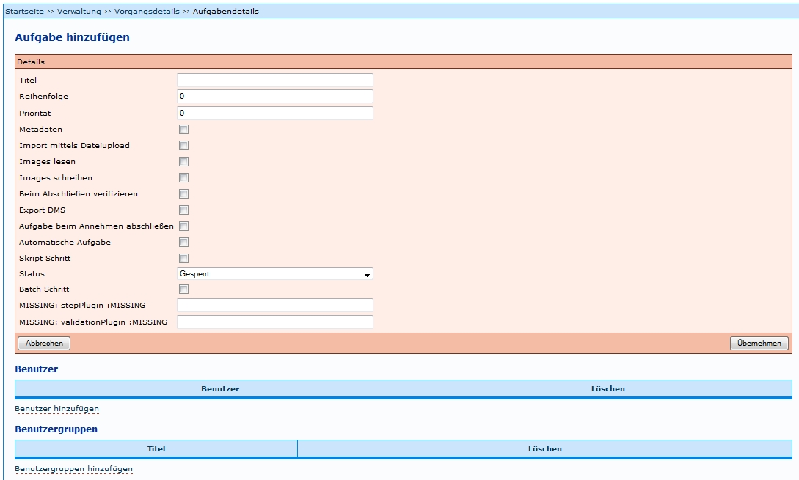

# Einführung

Die Einstiegsseite bietet eine Übersicht über bereits vorhandene Produktionsvorlagen. Für jede Produktionsvorlage können per Mausklick auf das Symbol die aktuell zugewiesenen Aufgaben in ihrer Abfolge (Workflow) angezeigt werden.

* Produktionsvorlagen, der Bearbeitungsstatus sowie Projekte können auf- und absteigend sortiert werden.
* Rechts oberhalb der Tabelle lässt sich ein Filter für die Vorgangstitel und Projekte aktivieren; daneben befinden sich die Buttons 'Filter anwenden' zur Aktivierung desselben und 'Hilfe zum Filter' mit Link auf den Artikel Filter für Vorgänge in diesem Wiki.

Die Produktionsvorlagen lassen sich über Buttons in der Spalte 'Auswahl' editieren (Erläuterungen siehe Tabelle unten).
Darüber hinaus können Aktionen für alle Vorgänge über die separate Tabelle Mögliche Aktionen gestartet werden.

## Beschreibung der Aktionen

 *Vorgang bearbeiten*:

Ermöglicht das Bearbeiten der Vorgangsdetails einer bereits vorhandenen Produktionsvorlage; Detailangaben siehe unten 'Eine neue Produktionsvorlage anlegen'.

 *Diese Vorlage enthält Schritte mit unvollständigen Angaben*:

Weist darauf hin, dass in der Vorlage noch elementare Angaben (Pflichtfelder) für einen funktionierenden Workflow fehlen. Auf Basis dieser Produktionsvorlage lässt sich bspw. noch kein neuer Vorgang anlegen. Per Mausklick auf den Button wird ausgewiesen, welche Angaben fehlen.

 *Einen Vorgang auf der Basis dieser Produktionsvorlage anlegen*:

Auf diese Weise kommt das Template als Vorlage für die konkreten Anwendungsfälle (sprich: den einzelnen zu digitalisierenden Titel) zum Einsatz. Es öffnet sich dasselbe Formular für Neuen Vorgang anlegen, das auch Mitarbeiter mit Prozessverwaltungsrechten (Benutzergruppe: Verwaltung) für das Anlegen von Vorgängen auf der Basis bereits vorhandener Produktionsvorlagen benutzen.

 

Über den Link *Neue Produktionsvorlage anlegen* im unteren Bereich der Übersicht öffnet sich eine Eingabemaske zum Anlegen einer neuen Produktionsvorlage. Der Ablauf wird im nächsten Abschnitt ausführlich erläutert.

# Eine neue Produktionsvorlage anlegen

Auf der Administrationsebene ist das Procedere für das Anlegen eines Vorganges identisch mit dem des Anlegens einer Produktionsvorlage (= als Template verwendeter Vorgang).

## 1 Festlegen der Details für einen Vorgang (Produktionsvorlage)

Nach betätigen des Links erscheint eine Eingabemaske mit mehreren Eingabemöglichkeiten.

* *Vorgangstitel*: Hier muss ein aussagekräftiger Titel für die Vorlage eingegeben werden.
* *Projekt*: Hier muss ein [Projekt](Projekt) ausgewählt werden.
* *Regelsatz*: Hier muss der [Regelsatz](Regelsatz) für die betreffende Einrichtung ausgewählt werden
* *Laufzettel*: Hier muss der entsprechende [Laufzettel](Regelsatz) ausgewählt werden.
* *In Auswahlliste anzeigen*: Über die Auswirkung dieses Felds gibt es keine gesicherten Erkenntnisse.
* *Ist eine Vorlage*: Erst mit der Bestätigung dieses Feldes wird ein Vorgang als [Produktionsvorlage](Produktionsvorlage) definiert und entsprechend bereitgestellt.

 
## 2 Abfolge der Aufgabe und Eigenschaften hinzufügen
Der vorige Schritt erstellt zwar eine Produktionsvorlage, jedoch müsen dieser auch die jeweiligen Aufgaben zugewiesen werden, um sie benutzbar zu machen. 

Wenn *Aufgabe hinzufügen* ausgewählt wird, erscheint eine Eingabemaske, in der Angaben zur Aufgabe eingetragen werden müssen. Eine ausführliche Anleitung dazu findet sich unter [Bearbeitung Aufgabe](Bearbeitung-Aufgabe). Beispiele zu bestimmten Einstellungen der Aufgaben finden sich unter [Aufgaben Einstellungen](Aufgaben-Einstellungen).

Es muss daran gedacht werden, dass jeder Aufgabe auch die entsprechende [Benutzergruppe](Benutzergruppen) zugeordnet wird. Ansonsten finden die Benutzer der Benutzergruppe die Aufgabe nicht unter Meine Aufgaben.

Dies muss für jede Aufgabe (Scannen, Metadaten, ...) wiederholt werden.

