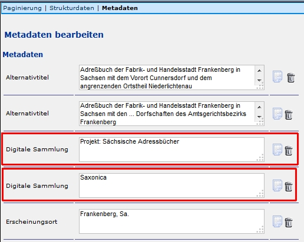

Die Digitale Kollektion ist in Kitodo.Production ein Metadatum, das im [Metadateneditor](https://github.com/kitodo/kitodo-production/wiki/Metadateneditor---Allgemeines) _Digitale Sammlung_ benannt ist.
Zusätzlich kann dieses Metadatum dazu genutzt werden, um in der Präsentation alle Werke einer Sammlung in einer "Kollektion" zusammenzuführen. Um dies zu ermöglichen, sind Hintergrundeinstellungen nötig (siehe [Digitale Kollektionen (XML Datei)](https://github.com/kitodo/kitodo-production/wiki/Digitale-Kollektionen-%28XML-Datei%29)), die von den IT-Administratoren durchgeführt werden. Wenn diese Einstellungen nicht durchgeführt werden, kann die Kollektion zwar im Metadateneditor vergeben, jedoch nicht angewendet werden.

Wenn die Definition von Kollektionen für die Präsentation auf einem anderen Weg realisiert wird, kann auf die Belegung dieses Metadatums verzichtet werden. 

Digitale Kollektion beim Anlegen eines Vorgangs in Kitodo.Production:

Digitale Kollektion (=Digitale Sammlung) als Metadatum im Metadateneditor in Kitodo.Production:

Formal gilt zudem in der SLUB:

* Die Digitale Kollektion ist ein Pflichtfeld, so dass einem Vorgang mindestens eine Kollektion zugewiesen werden muss
* Einem Vorgang können aber auch mehrere Kollektionen zugewiesen werden
* Die Kollektion kann, muss aber nicht mit einem [Projekt](https://github.com/kitodo/kitodo-production/wiki/Projekt) übereinstimmen 
