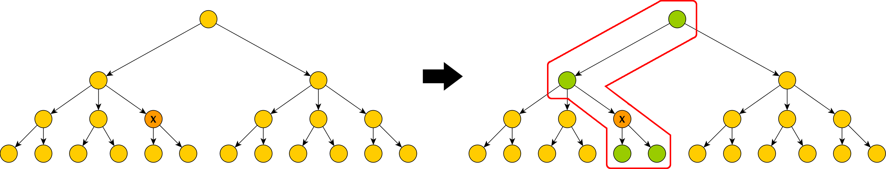

# MODS-Plugin

The MODS plugin allows users to import documents into Kitodo.Production from the Kalliope Union Catalog using the [SRU interface]((http://kalliope.staatsbibliothek-berlin.de/de/support/sru.html)). The import process resembles that of the existing Pica Plugin and is initiated from the form to create new processes. After adding the plugin to Kitodo.Production, the user has the option to select „Kalliope“ from the „Search in OPAC“ pulldown menu, in addition to other catalogues that may have been configured for other plugins. The MODS plugin furthermore allows configuration of additional catalogues that return their data in the MODS format,  by adding „catalogue“ elements for each individual catalogue to the plugin configuration file [kitodo_mods_opac.xml](https://github.com/kitodo/kitodo-production/blob/2.x/Goobi/config/kitodo_mods_opac.xml).

All Kalliope documents imported this way are classified as „Inventory“ (German: „Bestand“), while all direct child elements and all ancestors up to the root element of the inventory are returned as the structural data of the requested document.

The following examples aim to visualize which structural elements are included when importing Kalliope documents. The trees in the examples are abstract representations of "Inventories" in Kalliope.

The orange node labeled with an "X"  marks the document selected for import by the user.

The green nodes  mark all structural elements that will be included in that specific import.

Example 1:


Example 2:



In addition, the MODS plugins allows the user to filter the search results by institution. For this purpose the form displays an extra pulldown menu, containing the names of all institutions available for filtering the search results, whenever the user selects „Kalliope“ from the OPAC pulldown menu. This list can be configured using the configuration file of the plugin.

## Configuration

The following aspects of the MODS plugin can be configured via the file „kitodo_mods_opac.xml“.

### Search Fields

With the initial configuration, the MODS plugin supports search queries using the fields „Titel“, „Creator“, „Creation Date“, „Identifier“, „Genre“ and „Keyword“. When sending the request to the Kalliope SRU interface these field names are mapped to the corresponding Kalliope index fields.

The search fields and their mappings can be configured using the plugin configuration file. Within an enclosing „searchFields“ element, the file contains a „searchField“ child element for each field mapping. Each of these „searchField“ elements contains the two attributes „label“ and „value“. While the „label“ attributes contain the field names that will be displayed in the import form for each search field, the „value“ attributes hold the corresponding search field parameter as it is used by the Kalliope SRU interface. The following listing shows this field mapping in its initial form:

```
    <searchFields>
        <searchField label="Title" value="ead.title" />
        <searchField label="Creator" value="ead.creator" />
        <searchField label="Identifier" value="ead.id" />
        <searchField label="Creation date" value="ead.creationdate.normal" />
        <searchField label="Genre" value="ead.genre" />
        <searchField label="Keyword" value="ead.keyword" />
    </searchFields>
```

A complete list of all search fields available in the Kalliope SRU interface can be obtained from [http://kalliope.staatsbibliothek-berlin.de/de/support/cql.html](http://kalliope.staatsbibliothek-berlin.de/de/support/cql.html).

### Institution Filter

When searching for documents in the Kalliope Union Catalog using the import form of Kitodo.Production, the resulting hit list can be restricted to individual holding institutions. These institutions can be selected via an additional pulldown menu whenever the user selects a catalogue for which such institutions have been configured in the plugin configuration file.

Similarly to searchFields, the configuration of institutions is done on a per-catalogue basis. To activate this feature for a specific catalogue, the corresponding catalogue element in the plugin configuration file requires a „filterInstitutions“ element, that in turn contains individual „institution“ child elements that represent the individual holding institutions configured for this catalogue. Each of these „institution“ elements again contains two attributes „label“ and „value“. The „label“ attribute contains the name of the institution how it is displayed in the Kitodo.Production import form. The „value“ attribute of an „institution“ element holds the value for the parameter specified in the „institutionFilterParameter“ element (see next section) that is passed to the SRU interface to restrict a search to the corresponding institution.

In case of the Kalliope Union Catalog, the „value“ attribute therefore contains the ISIL-ID of each such institution.

```
    <filterInstitutions>
        <institution label="Deutsche Nationalbibliothek" value="DE-101" />
        <institution label="Universitätsbibliothek &lt;Leipzig&gt;" value="DE-15" />
        <institution label="Sächsische Landesbibliothek - Staats- und Universitätsbibliothek &lt;Dresden&gt;" value="DE-14" />
        <institution label="Staats- und Universitätsbibliothek Hamburg Carl von Ossietzky" value="DE-18" />
        <institution label="Staatsbibliothek zu Berlin - Preußischer Kulturbesitz, Haus Unter den Linden" value="DE-1" />
    </filterInstitutions>
```

### Filter Parameter

The element „institutionFilterParameter“ allows the user to configure the name of the parameter that is used to filter search results by institution. The „value“ attribute of the element contains the name of the corresponding URL parameter. For Kalliope, this value points to the Parameter „ead.repository.isil“:

```
    <institutionFilterParameter value="ead.repository.isil" />
```

Whenever this parameter is changed, the „value“ attributes of the „institution“ elements have to be adapted accordingly (see last section).
### Structural Elements

All documents imported via the Kalliope SRU interface require the structural elements „Inventory“ (German: „Bestand“), „Subinventory“ (German: „Unterbestand“) and „Manuscript“. These structural types need to be added to the ruleset file in use, if they are not already available. An exemplary configuration for the types „Inventory“ and „Subinventory“ follows:

```
    <DocStrctType>
        <Name>Inventory</Name>
        <language name="de">Bestand</language>
        <language name="en">Inventory</language>
        <allowedchildtype>Subinventory</allowedchildtype>
        <allowedchildtype>Manuscript</allowedchildtype>
        <metadata num="1o">ProcessID</metadata>
        <metadata DefaultDisplay="true" num="1m">TitleDocMain</metadata>
        <metadata num="1o">TitleDocMainShort</metadata>
        <metadata DefaultDisplay="true" num="1m">CatalogIDDigital</metadata>
        <metadata DefaultDisplay="true" num="1o">shelfmarksource</metadata>
        <metadata DefaultDisplay="true" num="1o">PublicationDate</metadata>
        <metadata num="1o">PublicationYear</metadata>
        <metadata DefaultDisplay="true" num="*">PlaceOfPublication</metadata>
        <metadata num="*">Author</metadata>
        <metadata num="1o">slub_ownerOrig</metadata>
        <metadata num="1o">slub_ownerDigi</metadata>
        <metadata num="1o">slub_licensor</metadata>
        <metadata num="1o">slub_link</metadata>
        <metadata num="1o">slub_linktext</metadata>
        <metadata num="*">singleDigCollection</metadata>
        <metadata num="*">FormatSourcePrint</metadata>
        <metadata DefaultDisplay="true" num="1o">SizeSourcePrint</metadata>
        <metadata DefaultDisplay="true" num="1o">TSL_ATS</metadata>
        <metadata num="*">slub_project</metadata>
    </DocStrctType>
    <DocStrctType>
        <Name>Subinventory</Name>
        <language name="de">Unterbestand</language>
        <language name="en">Subinventory</language>
        <allowedchildtype>Subinventory</allowedchildtype>
        <allowedchildtype>Manuscript</allowedchildtype>
        <metadata num="1o">ProcessID</metadata>
        <metadata DefaultDisplay="true" num="1o">CurrentNo</metadata>
        <metadata DefaultDisplay="true" num="1o">CurrentNoSorting</metadata>
        <metadata DefaultDisplay="true" num="1m">TitleDocMain</metadata>
        <metadata DefaultDisplay="true" num="1o">PublicationDate</metadata>
        <metadata num="1o">PublicationYear</metadata>
        <metadata DefaultDisplay="true" num="*">PlaceOfPublication</metadata>
        <metadata num="1o">TitleDocMainShort</metadata>
        <metadata num="*">Author</metadata>
        <metadata DefaultDisplay="true" num="1m">CatalogIDDigital</metadata>
        <metadata num="1o">slub_ownerOrig</metadata>
        <metadata num="1o">slub_ownerDigi</metadata>
        <metadata num="1o">slub_licensor</metadata>
        <metadata num="1o">slub_link</metadata>
        <metadata num="1o">slub_linktext</metadata>
        <metadata num="*">singleDigCollection</metadata>
        <metadata num="*">FormatSourcePrint</metadata>
        <metadata DefaultDisplay="true" num="1o">SizeSourcePrint</metadata>
        <metadata DefaultDisplay="true" num="1o">shelfmarksource</metadata>
        <metadata DefaultDisplay="true" num="1o">slub_footer</metadata>
        <metadata DefaultDisplay="true" num="*">slub_Finance</metadata>
        <metadata num="1o">slub_script</metadata>
        <metadata num="*">slub_project</metadata>
    </DocStrctType>
```

### Classification of Structural Elements

The plugin configuration file also contains classification rules for the structural elements mentioned in the last section. These rules utilize XPath expressions to test for the existence („mandatoryelement“) and absence („forbiddenelement“) of specific elements within the XML structure of individual documents to decide which class each document belongs to. Each group of these conditions defines mutually exclusive subsets of all available documents.

The initial configuration contains the following rules for the structural elements "Inventory", "Subinventory" and "Manuscript":

A Kalliope document is classified as a structural element of type "Manuscript" if the following criteria are met:

- the XML DOM of the current document contains an element at the XPath `"mods/relatedItem/identifier[@type='localparentid']"` which in turn contains the ID of this documents parent document in Kalliope
- the XML DOM of the current document contains an element at the XPath `"mods/typeOfResource[@manuscript='yes']"`

A Kalliope document is classified as a structural element of type "Subinventory" if the following criteria are met:

- the XML DOM of the current document contains an element at the XPath `"mods/relatedItem/identifier[@type='localparentid']"`, which in turn contains the ID of this documents parent document in Kalliope
- the XML DOM of the current document contains **no** element at the XPath `"mods/typeOfResource[@manuscript='yes']"`

A Kalliope document is classified as a structural element of type "Inventory" if the following criteria are met:

- the XML DOM of the current document contains **no** element at the XPath `"mods/relatedItem/identifier[@type='localparentid']"`
- the XML DOM of the current document contains an element at the XPath `"mods/typeOfResource[@collection='yes']"`

### Mapping File

The mapping file configured in the last section contains the catalogue specific mapping between catalogue metadata fields and Kitodo metadata fields. The mapping is specified as an XML transformation file and can be configured using standard XSLT and XPath syntax.

```
    <mappingFile>kalliope2kitodo.xsl</mappingFile>
```

The plugin looks for the mapping file with this name in the global „xsl“ folder of the Kitodo.Production installation, which can be configured in the global configuration file „goobi_config.xml“.

## Metadata Mapping

The mapping file configured in the last section contains the catalogue specific mapping between catalogue metadata fields and Kitodo metadata fields. The mapping is specified as an XML transformation file and can be configured using standard XSLT and XPath syntax.

For Kalliope, the mapping file [kalliope2kitodo.xsl](https://github.com/kitodo/kitodo-production/blob/2.x/Goobi/plugins/opac/ModsPlugin/org/kitodo/production/plugin/CataloguePlugin/ModsPlugin/kalliope2kitodo.xsl) contains an XSL template for each metadata field in Kalliope that should be mapped to a corresponding field in Kitodo. The following shows an example for such an XSL template:

```
    <xsl:template match="mods:mods/mods:originInfo/mods:place/mods:placeTerm[@type='text']">
        <goobi:metadata name="PlaceOfPublication"><xsl:value-of select="normalize-space()" /></goobi:metadata>
    </xsl:template>
```

The templates „match“ attribute contains an XPath identifying the metadata element to be mapped in the imported document. Any content between the opening and closing „xsl:template“ tags is used to create the content at the corresponding position in the mapped output document. Tags in the „xsl“ namespace are interpreted as control flow instructions. For example, „xsl:value-of“ reads the text content of a specified XML node. [http://www.w3schools.com/xml/xsl_intro.asp](http://www.w3schools.com/xml/xsl_intro.asp) can be used as a short introduction for XSLT.
