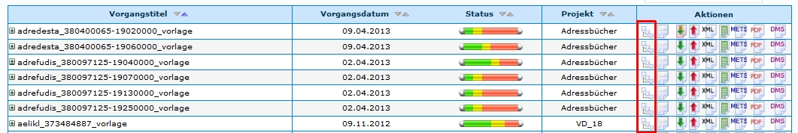
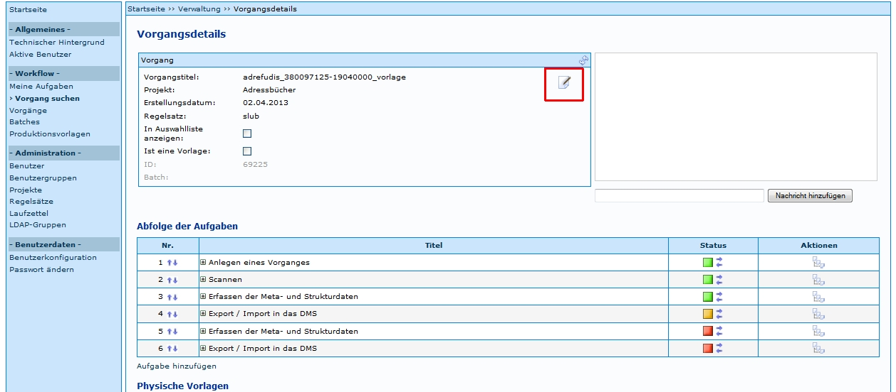

In Kitodo.Production können Vorgänge gelöscht werden. Diese Funktion sollte jedoch mit Vorsicht genutzt werden, da die Wiederherstellung eines Vorgangs nur mit Aufwand möglich ist. Je nach Organisation der Digitalisierung muss beachtet werden, dass

* der Vorgang schon in einer Präsentation angezeigt wird, wo er gegebenenfalls auch gelöscht werden soll
* der Vorgang archiviert wurde, und die dortige Datei gegebenenfalls auch nicht mehr benötigt wird (und somit auch dort gelöscht werden soll)
* von dem Vorgang Backups existieren, die gegebenenfalls auch gelöscht werden sollen
 

Das Löschen in Kitodo.Production selbst erfolgt nach den folgenden Schritten:

Zuerst müssen die Vorgangsdetails eines Vorgangs geöffnet werden:

 
Danach kann das Symbol  unter _Vorgang_ angeklickt werden:

Die Anzeige ändert sich und es kann der Button _Speichern_ geklickt werden: 

Wenn die darauf folgende Meldung mit OK bestätigt wird, wird der Vorgang gelöscht.