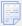
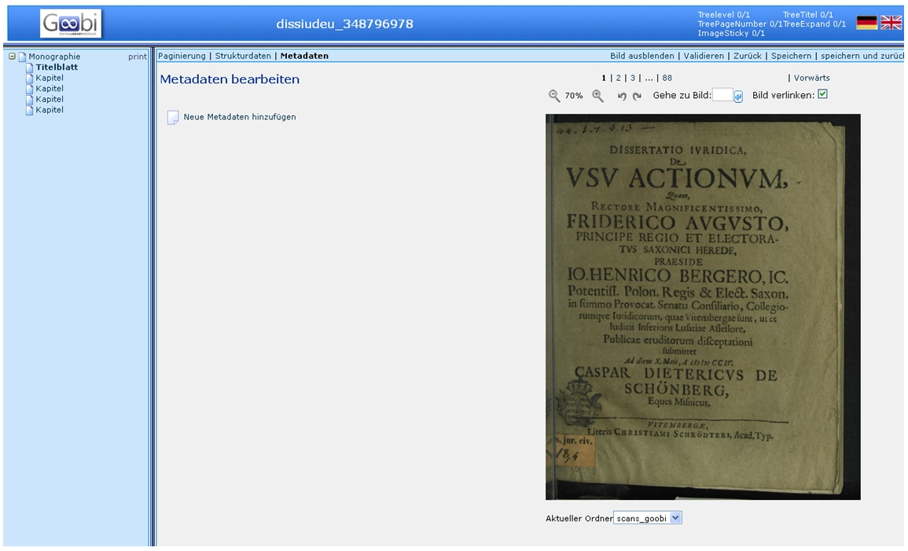

# Allgemeines

Die [Strukturelemente](Strukturdaten-bearbeiten) eines Werkes werden in der Präsentation des digitalisierten Werkes angezeigt und können durch die Zuweisung der zugehörigen Images direkt aufgerufen werden. Zu jedem Strukturelement können weitere, beschreibende Metadaten erfasst werden. Dazu gehören der aussagekräftige Titel des Strukturelements (zum Beispiel Kapitelüberschriften) und speziell zu diesem Strukturelement gehörige Personen.

Für die übergeordneten Strukturelemente Monographie, Mehrbändiges Werk/Band bzw. Handschrift werden in der SLUB die bibliothekarischen Metadaten beim Anlegen eines Vorganges direkt aus dem SWB importiert. Es können hier auch andere Quellen ausgewählt werden, bzw. können die Metadaten auch manuell eingegeben/ergänzt werden.

Hat ein Strukturelement keinen aussagekräftigen, eigenständigen Titel (z.B. Titelblatt, Vorwort, Einleitung, Inhaltsverzeichnis), werden keine zusätzlichen Metadaten erfasst. In der Präsentation wird nur die Benennung des jeweiligen Strukturelemnts (zum beispiel Titelblatt) angezeigt.

Um Metadatendaten erfassen zu können, muss im Metadateneditor der Reiter *Metadaten* ausgewählt werden. Die danach erscheinende Ansicht lässt sich in drei Teile gliedern: Linke Seite, Mitte und Rechte Seite:

Linke Seite:

* Die Struktur des Werkes wie als Baumstruktur angezeigt
* übergeordnetes Strukturelement Monographie, Mehrbändiges Werk und Band beziehungsweise Handschrift wird automatisch erzeugt
* das Strukturelement, das mit den Funktionen in der Mitte bearbeitet werden kann ist Fett hervorgehoben

Mitte:

* Anzeige der vorhandenen Metadaten des ausgewählten Strukturelements 
* Funktionen zur Eingabe weiterer Metadatenfelder und deren Inhalte

Rechte Seite:

* Images
* Einstellungen zur Ansicht (Imagegröße, Bildverlinkung, …)
* Befehlleiste (Speichern, Zurück, Validieren)

 
# Funktionen

 Neue Metadaten hinzufügen

Wird dieser Text angeklickt, öffnet sich eine Box Metadaten bearbeiten, in der unter Typ ein Metadatum ausgewählt werden kann, welches in dem Feld Wert mit der jeweiligen Information, zum Beispiel dem Titel angereichert werden kann.

 Neue Person hinzufügen

Wird dieser Text angeklickt, öffnet sich eine Box Person bearbeiten, in der unter Vorname, Name und Rolle die jeweiligen Metadaten ausgewählt, bzw. eingegeben werden können.

 Metadaten löschen

Durch Anklicken dieses Icons wird das links davon aufgeführte Metadatum gelöscht.

 Metadaten kopieren

Durch Anklicken dieses Icons wird das links davon aufgeführte Metadatum kopiert.

# Ablauf

* betreffendes Strukturelement im Strukturbaum markieren
* benötigte Felder vorlagegemäß ausfüllen
* nicht benötigte Felder können freigelassen werden
* weitere Felder über Funktion *Neue Metadaten hinzufügen* auswählen und belegen
* Speichern

Dies wird für alle Strukturelemente eines Werkes wiederholt, die mit beschreibenden Metadaten versehen werden sollen.

**ACHTUNG**: für jedes Strukturelement werden zunächst nur die am häufigsten vorkommenden Metadaten zur Belegung angezeigt. In der Auswahlliste aller möglichen Metadaten werden jeweils nur die für das jeweilige Strukturelement zulässigen Metadaten in der Auswahlliste angezeigt.
 

Beispiel Strukturelement *Kapitel* mit Metadaten:

 

Beispiel Strukturelement *Titelblatt*: keine zusätzlichen Metadaten vorgeschlagen:

 

Beispiel *Neue Metadaten hinzufügen*: Auswahlliste zugelassener Metadaten für das Strukturelement:

 
