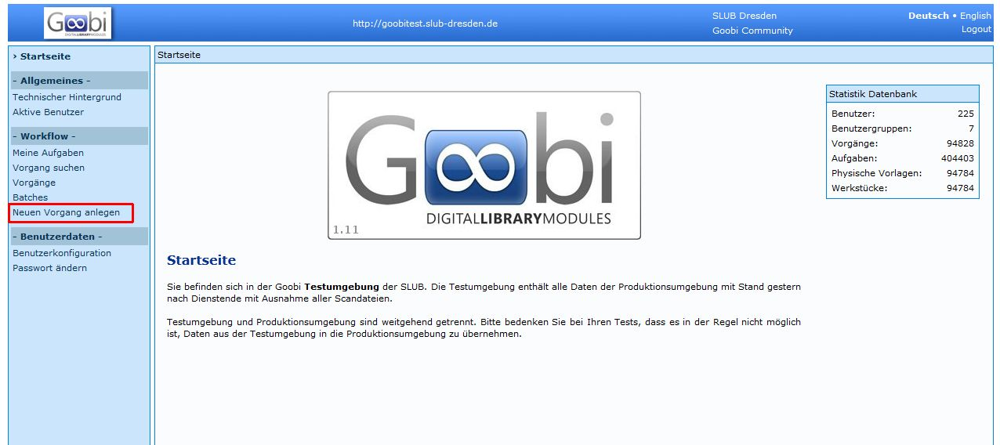
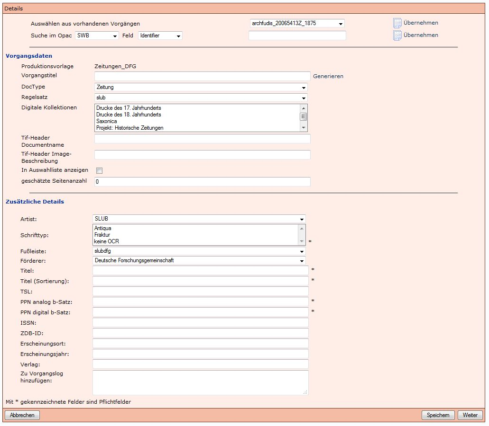
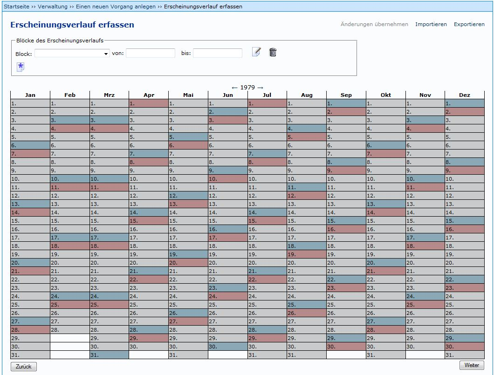
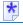
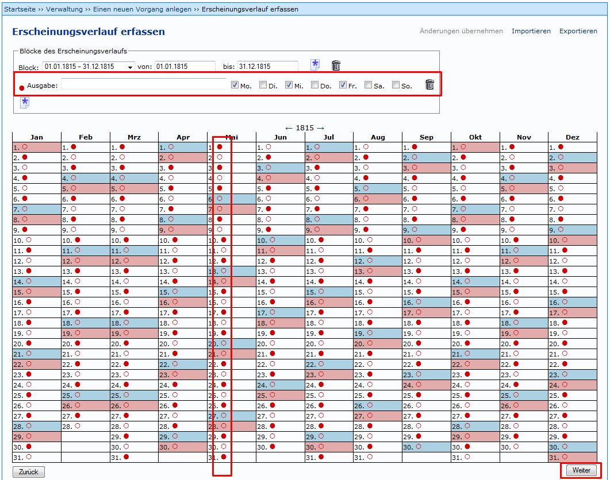
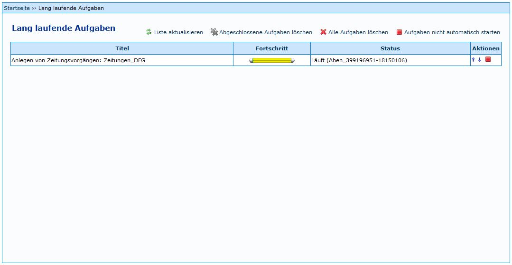

Zum Anlegen von Zeitungen wurde in Kitodo.Production ein neues Modul implementiert, das automatisch [Vorgänge](Vorgang) auf Ausgabeebene anlegt. Auf dieser Seite wird beschrieben, wie die Vorgänge angelegt werden. Am Ende der Seiten werden Besonderheiten erläutert. 

Durch *Neuen Vorgang anlegen* auswählen, erhält man eine Übersicht der [Produktionsvorlagen](Produktionsvorlage).

Es muss die korrekte Produktionsvorlage mit  ausgewählt werden.

 

Dadurch öffnet sich die Eingabemaske zum Datenimport aus dem SWB.

Neben dem Identifier wird die SWB-PPN der Zeitungsaufnahme eingegeben und mit Klick auf *Übernehmen* werden die Metadaten übernommen.

Es sollte automatisch der DocType Zeitung ausgewählt sein. Wenn dies nicht der Fall ist, und zum Beispiel Zeitschrift angezeigt wird, muss nachträglich Zeitung ausgewählt werden.

Zudem müssen folgende Pflichtfelder belegt werden:

* Digitale Kollektionen
* Schrifttyp

Mit *Weiter* wird der Schritt abgeschlossen und es öffnet sich ein neues Fenster.
 

In diesem Modul lassen sich die Ausgaben von Zeitungen eintragen, die danach automatisch als Vorgänge in Kitodo.Production angelegt werden sollen.

Hierzu wird zuerst der Zeitraum definiert, in dem die Zeitung erschienen ist (zum Beispiel 01.01.1815 bis 31.12.1815). Mit  (*Block erstellen*) wird der Block erstellt und der Kalender wird "heller"

Jetzt kann der korrekte Block ausgewählt werden und über das linke Symbol  (*Ausgabe hinzufügen*) werden weitere Optionen angeboten.

Jetzt können die Tage ausgewählt werden, an denen eine Ausgabe der Zeitung erschienen ist und die auch in Kitodo.Production angelegt werden sollen. Unregelmäßigkeiten können durch An- und Abwählen der roten Punkte, bzw. roten Kreise ausgeglichen werden. Mit *Weiter* wird das nächste Fenster geöffnet.

 

In diesem Fenster wird die Anzahl der Seiten je Ausgabe eingegeben. Außerdem muss die Granularität angegeben werden. Soll etwa je Ausgabe ein Vorgang angelegt werden, oder soll für jeden Monat ein Vorgang angelegt werden, in dem die jewweiigen Ausgaben als Strukturelemente enthalten sind. In der SLUB wird bei der Granularität *Ausgabe* gewählt.

Tipp: Wenn die Anzahl der Vorgänge bekannt ist, kann dieser Wert  mit der berechneten Anzahl der Vorgänge verglichen werden. Abweichungen können so erkannt und korrigiert werden.

Durch *Vorgänge anlegen* wird der Taskmanager gestartet, der die Vorgänge automatisch anlegt.

Der Taskmanager läuft auch, wenn man in Kit weiterarbeitet. es muss also nicht gewartet werden, bis alle Vorgänge angelegt sind.

 **Anlegen weiterer Blöcke**

Wenn ein weiterer Block erstellt werden soll, kann nicht über "Block hinzufügen" die Ausgaben ausgewählt werden. Folgende Vorgehensweise muss eingehalten werden:

1. Löschen des vorigen Ausgabenblocks mit dem Symbol .
2. Eingabe des Erscheinungsdauer in den Feldern *von* und *bis*. 
3. Erstellen des neuen Blocks mit dem Symbol  (Ausgabe hinzufügen), nicht mit dem gleich aussehenden Symbol Block kopieren (siehe folgendes Bilddatei)!

**Mehrere Ausgaben pro Tag**

Sollen weitere Ausgaben für einem Tag angelegt werden, an dem schon eine Ausgabe erschienen ist, können über das Symbol (Ausgabe hinzufügen) weitere Ausgaben hinzugefügt werden. Es muss jedoch beachtet werden, dass die PPN digital im Vorgangstitel (zum Beispiel von *DresVo_**416951805-19241208**_sond* zu *DresVo**_416951805-1924120802**_sond*) geändert werden muss.

Wenn dies nicht durchgeführt wird, werden die beiden Vorgänge auf Grund derselben PPN in der Präsentation überschrieben.