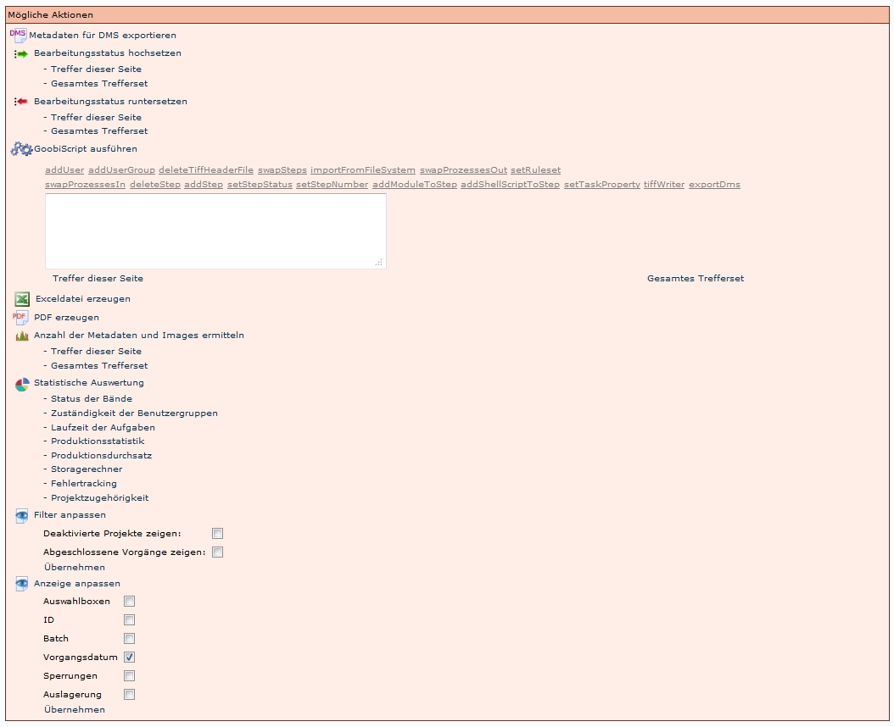

# Einleitung

Aktionen sind in diesem Abschnitt definiert als Befehle, die ausgelöst werden können und die eine Auswirkung nach sich ziehen. In diesem Abschnitt werden die Aktionen mit den jeweiligen Schaltflächen, durch die sie ausgelöst werden, vorgestellt. Somit kann der Abschnitt auch genutzt werden, um Unklarheiten hinsichtlich der Interpretation der Symbole zu beseitigen.

Es gibt unterschiedliche Aktionen in mehreren Bereichen: 

* Prozessverwaltung:
	* Vorgangsaktionen
	* Benutzeraktionen
* Prozessbearbeitung:
	* Vorgangsaktionen
	* Benutzeraktionen
* Benutzerbearbeitung

# Prozessverwaltung
## Vorgangsaktionen
In diesem Abschnitt werden die Aktionen beschrieben die unter *Vorgang suchen* für Vorgänge angeboten werden. 

 Vorgang bearbeiten

Mit dieser Aktion lassen sich die [Vorgangsdetails](Vorgangsdetails) aufrufen und bearbeiten. 

 Metadaten bearbeiten

Mit dieser Aktion lässt sich der [Metadateneditor](Metadateneditor---Allgemeines) aufrufen um die Metadaten zu bearbeiten.
**ACHTUNG!**: Dieser Weg sollte nur in Ausnahmefällen gewählt werden. Der Metadateneditor sollte normalerweise über  Meine Aufgaben geöffnet werden, um Meta- und Strukturdaten zu bearbeiten. 

 Im Homeverzeichnis verlinken

Mit dieser Aktion werden die Ordner mit den Images in das [Homeverzeichnis](Homeverzeichnis) des Benutzers verlinkt, wo Images bearbeitet (Umbenennung, Löschen, Hinzufügen,...) werden können.

 Verlinkung aus dem Homeverzeichnis entfernen

Mit dieser Aktion wird die Verlinkung aus dem [Homeverzeichnis](Homeverzeichnis) wieder entfernt.

 Export des Logfiles in das Homeverzeichnis

Mit dieser Aktion werden die Logfiles in das [Homeverzeichnis](Homeverzeichnis) exportiert.

 Laufzettel drucken

Mit dieser Aktion kann ein [Laufzettel](Laufzettel) auf Basis der docket.xls geöffnet und ausgedruckt werden.

 Export der Metadaten als METS-Datei in das Homeverzeichnis

Mit dieser Aktion wird eine METS-Datei in das [Homeverzeichnis](Homeverzeichnis) exportiert. Es handelt sich hierbei nicht um die meta.xml Datei, die die Metadaten und Strukturdaten enthält, sondern um eine Datei, die Informationen zu Strukturen der unterschiedlichen Imageversionen (thumb, klein, PDF,...) in der Präsentation enthält.

 Export der Metadaten als METS-Datei in das Homeverzeichnis 

Wenn das Symbol ausgegraut ist, bedeutet es, dass noch keine Images in dem Vorgang sind. Die Aktion kann nicht ausgeführt werden.

 Export der Images zusammen mit den Metadaten als PDF-Datei in das Homeverzeichnis

Mit dieser Aktion werden die Images mit den Metadaten als PDF-Datei in das [Homeverzeichnis](Homeverzeichnis) exportiert.

 Export der Images zusammen mit den Metadaten als PDF-Datei in das Homeverzeichnis

Wenn das Symbol ausgegraut ist, bedeutet es, dass noch keine Images in dem Vorgang sind. Die Aktion kann nicht ausgeführt werden.

 Export in das DMS

Mit dieser Aktion wird der Vorgang in das DMS exportiert

 Export in das DMS

Wenn das Symbol ausgegraut ist, bedeutet es, dass noch keine Images in dem Vorgang sind. Die Aktion kann nicht ausgeführt werden.

# Benutzeraktionen
In diesem Abschnitt werden die Aktionen beschrieben die unter *Mögliche Aktionen* angeboten werden und je nach Berechtigungsstufe variieren. Hier werden alle  Aktionen beschrieben, die dem Administrator zur Verfügung stehen. 

 Metadaten für DMS exportieren

Wenn der Nutzer die entsprechenden Rechte hat, kann mit dieser Aktion der Export der Images und der Metadaten ausgelöst werden.

 Bearbeitungsstatus hochsetzen

Mit dieser Aktion kann der [Status](https://intranet.slub-dresden.de/display/GOOBI/Aktionen) einer Aufgabe administrativ höher gesetzt werden, bis alle Aufgaben abgeschlossen sind. Es jeweils angewendet auf:

* Treffer dieser Seite 
* Gesamtes Trefferset

Deshalb muss unbedingt darauf geachtet werden, dass nur die Vorgänge angezeigt werden, die wirklich geändert werden sollen. Vor allem, wenn der Abschluss einer Aufgabe eine andere Aktion automatisch auslöst (wie die Durchführung der OCR), können schwerwiegende Fehler entstehen.

Bearbeitungsstatus runtersetzen

Mit dieser Aktion kann der [Status](Status-der-Aufgaben) einer Aufgabe administrativ herunter gesetzt werden, bis alle Aufgaben abgeschlossen sind. Es jeweils angewendet auf:

* Treffer dieser Seite 
* Gesamtes Trefferset

Deshalb muss unbedingt darauf geachtet werden, dass nur die Vorgänge angezeigt werden, die wirklich geändert werden sollen. Vor allem, wenn der Abschluss einer Aufgabe eine andere Aktion automatisch auslöst (wie die Durchführung der OCR), können schwerwiegende Fehler entstehen.

 GoobiScript ausführen

Hier werden unterschiedliche [Skripte](GoobiScript) angeboten. Sie können angewendet werden auf:

* Treffer dieser Seite 
* Gesamtes Trefferset

Deshalb muss unbedingt darauf geachtet werden, dass nur die Vorgänge angezeigt werden, die wirklich geändert werden sollen. Vor allem, wenn der Abschluss einer Aufgabe eine andere Aktion automatisch auslöst (wie die Durchführung der OCR), können schwerwiegende Fehler entstehen.

 Exceldatei erzeugen

Dieses Script erzeugt eine Excel Tabelle für alle Vorgänge der Trefferliste mit folgenden Angaben:

* Vorgangstitel    
* ID    
* Datum    
* CountImages    
* CountMetadata    
* Project    
* Status    
* AltRefNo    
* b-number

 

 PDF erzeugen

Dieses Script erzeugt eine PDF-Datei für alle Vorgänge der Trefferliste mit folgenden Angaben:

* Vorgangstitel    
* ID    
* Datum    
* CountImages    
* CountMetadata    
* Project    
* Status    
* AltRefNo    
* b-number

 

 Anzahl der Metadaten und Images ermitteln

Mit dieser Aktion wird die Anzahl der Images, Strukturelemente und Metadaten je Vorgang und insgesamt angezeigt (nur in HTML).
ACHTUNG: Es werden auch die Strukturelemente und Metadaten der Titeldaten angezeigt! Es lässt sich also nicht genau feststellen, wie viele Elemente für die Erschließung innerhalb eines Projekts angelegt wurden.

Die Aktion kann angewendet werden auf:

* Treffer dieser Seite 
* Gesamtes Trefferset

 Statistische Auswertung

Mit dieser Aktion kann die Trefferliste auf unterschiedliche Merkmale ausgewertet werden: 

* Status der Bände
* Zuständigkeit der Benutzergruppen
* Laufzeit der Aufgaben
* Produktionsstatistik
* Produktionsdurchsatz
* Storagerechner
* Fehlertracking
* Projektzugehörigkeit

 Filter anpassen

Mit dieser Aktion können bestimme Vorgänge von der Anzeige in der Trefferliste eingeblendet werden:

* Deaktivierte Projekte zeigen
* Abgeschlossene Vorgänge zeigen

ACHTUNG: Es ist voreingestellt, dass deaktivierte und abgeschlossene Vorgänge nicht in den Trefferlisten angezeigt werden!

 Anzeige anpassen

Mit dieser Aktion können bestimme Informationen eines Vorgangs ausgewählt werden, die in der Trefferliste angezeigt werden sollen: 

* Auswahlboxen 
* ID
* Batch
* Vorgangsdatum
* Sperrungen
* Auslagerung 

 ACHTUNG: Die Auswahl ist in der Regel nur für eine Session aktiv. das heißt, dass nach einer erneuten Anmeldung diese Auswahl erneut durchgeführt werden muss. 

# Prozessbearbeitung 
## Vorgangsaktionen

 Die Bearbeitung dieser Aufgabe übernehmen

Wenn diese Aktion ausgewählt wird, wird die Aufgabe übernommen und es stehen dem Benutzer je nach Arbeitsschritt die jewiligen Benutzeraktionen zur Verfügung.

 In Bearbeitung durch: XXXX, YYYY

Wenn ein anderer Nutzer diese Aufgabe bearbeitet, ist sie für alle anderen Nutzer gesperrt.

 In Bearbeitung durch: (einen selbst)

Dieses Symbol gibt an, dass man selber vergessen hat, diese Aufgabe wieder abzugeben. In diesem Fall kann man die Aufgabe selber wieder übernehmen.

## Benutzeraktionen

Je nach Aufgabe werden unterschiedliche Aktionen angeboten: 

### Erfassen der Meta- und Strukturdaten

  Metadaten bearbeiten

Mit dieser Aktion öffnet sich der Metadateneditor und es können die Paginierung, Strukturdaten und Metadaten bearbeitet werden.

 Die Bearbeitung dieser Aufgabe wieder abgeben

Mit dieser Aktion muss die Aufgabe nach der Bearbeitung im Metadateneditor abgegeben werden, ansonsten bleibt sie für andere Nutzer gesperrt.

 Korrekturmeldung an vorherige Station senden

Mit dieser Aktion wird der vorige Schritt wieder auf offen gesetzt. Zudem kann in ein Feld eine Benachrichtigung an den vorigen Bearbeiter geschrieben werden, in der der Grund für die Korrekturmeldung beschrieben wird (zum Beispiel fehlende Images, Metadaten,...)

 Die Bearbeitung dieser Aufgabe abschließen

Mit dieser Aktion wird der Status dieser Aufgabe auf abgeschlossen gesetzt und die folgende Aufgabe wird auf offen gesetzt.

### Scannen

 Die Bearbeitung dieser Aufgabe wieder abgeben

Mit dieser Aktion muss die Aufgabe nach der Bearbeitung im Metadateneditor abgegeben werden, ansonsten bleibt sie für andere Nutzer gesperrt.

 Korrekturmeldung an vorherige Station senden

Mit dieser Aktion wird der vorige Schritt wieder auf offen gesetzt. Zudem kann in ein Feld eine Benachrichtigung an den vorigen Bearbeiter geschrieben werden, in der der Grund für die Korrekturmeldung beschrieben wird (zum Beispiel fehlende Images, Metadaten,...)

 Meldung über Problemlösung an nachfolgende Station senden

Mit dieser Aktion kann nach der erfolgreichen Korrektur der Vorgang wieder an den nachfolgenden Bearbeiter (bzw. Benutzergruppe) gegeben werden. Zudem kann in ein Feld eine Benachrichtigung an den nachfolgenden Bearbeiter geschrieben werden. 

 Die Bearbeitung dieser Aufgabe abschließen

Mit dieser Aktion wird der Status dieser Aufgabe auf abgeschlossen gesetzt und die folgende Aufgabe wird auf offen gesetzt.

 

### Export / Import in das DMS

 Export in das DMS

Wenn der Nutzer die entsprechenden Rechte hat, kann mit dieser Aktion der Export der Images und der Metadaten ausgelöst werden.

 Die Bearbeitung dieser Aufgabe wieder abgeben

Mit dieser Aktion muss die Aufgabe nach der Bearbeitung im Metadateneditor abgegeben werden, ansonsten bleibt sie für andere Nutzer gesperrt.

 Korrekturmeldung an vorherige Station senden

Mit dieser Aktion wird der vorige Schritt wieder auf offen gesetzt. Zudem kann in ein Feld eine Benachrichtigung an den vorigen Bearbeiter geschrieben werden, in der der Grund für die Korrekturmeldung beschrieben wird (zum Beispiel fehlende Images, Metadaten,...)

 Die Bearbeitung dieser Aufgabe abschließen

Mit dieser Aktion wird der Status dieser Aufgabe auf abgeschlossen gesetzt und die folgende Aufgabe wird auf offen gesetzt.

# Benutzerbearbeitung

 Benutzer bearbeiten

mit dieser Aktion öffnet sich ein Formular, in dem die Angaben eines Benutzers bearbeitet werden können. Das Formular ist identisch mit dem zum Anlegen eines neuen Benutzers.

 Benutzerprofil laden

Mit dieser Aktion wird das aktuelle Benutzerprofil geändert. Der Administrator nimmt die Rolle des ausgewählten Benutzers an. Das ermöglicht ihm zum Beispiel die Simulation unterschiedlicher Einsatzszenarien oder kann bei der Fehlersuche hilfreich sein.

 Ldap-Konfiguration schreiben

