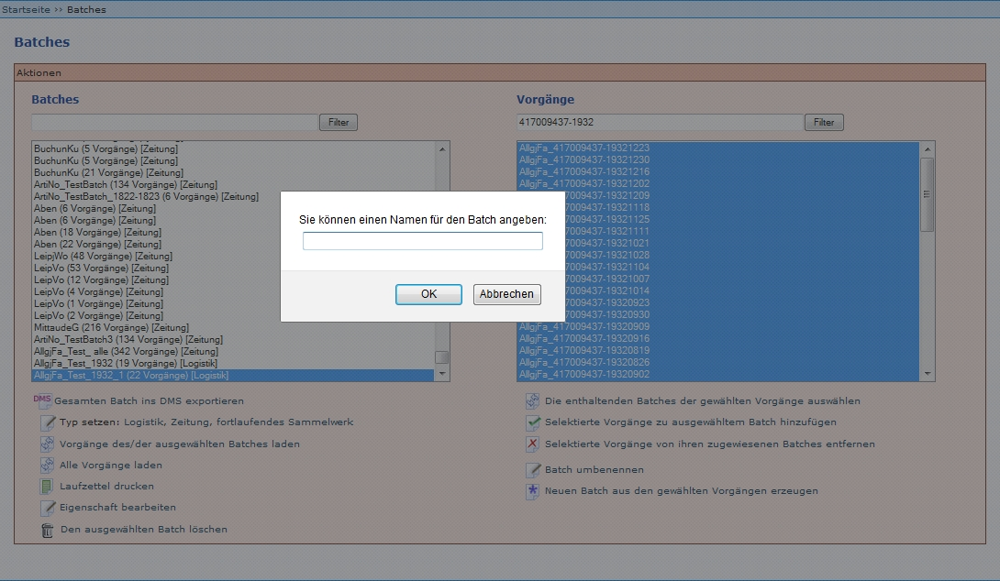

# Einleitung

Batches wurden ursprünglich dafür genutzt, um Laufzettel von mehreren Vorgängen gleichzeitig drucken zu können. Eine Weiterentwicklung ermöglicht jetzt den Export von Zeitungen, so dass in den METS-Dateien mehr Referenzierungen zu einander enthalten sind, die die Präsentation erleichtern. Weitere Informationen zur Batches-Funktion finden Sie in der Zeutschel-Dokumentation Goobi.Production 1.11 - TS-1090 (siehe Zeutschel-Dokumentation) unter *4.6 Erweiterung des Batches-Moduls*. 

Im Gegensatz zu [GoobiScripten](GoobiScript) lassen sich Batches auch ohne administrative Rechte auslösen. Auf dieser Seite wird beschrieben, wie die Benutzeroberfläche der Batches-Seite aufgebaut ist und welche Funktionen verfügbar sind. 

# Benutzeroberfläche

Im linken Menü befindet sich unter Workflow der Menüpunkt Batches, mit dem die Funktion aufgerufen wird. 

Das neue Fenster ist in drei Teile gegliedert: Batches, Vorgänge und Funktionen.

## Batches

Der Bereich *Batches* besteht aus zwei Feldern:

- Feld zum Filtern von Batches
- Feld zur Anzeige der Batches

Der Bereich *Batches* enthält vorhandene Batches, darunter sowohl

- manuell zusammengestellte Batches aus bestimmten Vorgängen
- automatisch zusammengestellte Batches (zum Beispiel beim Anlegen der Zeitungsvorgänge)

Batches können nur nach den TSL oder ATS gefiltert werden.

## Vorgänge

Der Bereich *Vorgänge* besteht aus zwei Feldern:

- Feld zum Filtern von Vorgängen
- Feld zur Anzeige der Vorgängen

Im Bereich *Vorgänge* werden

- alle Vorgänge, die mindestens einem Batch zugewiesen sind
- die enthaltenen Vorgänge eines oder mehrerer ausgewählter Batches
- gefilterte Vorgänge

angezeigt. Vorgänge können nach allen Bestandteilen des Vorgangstitels gefiltert werden. Zum Beispiel "417009437-1932", um alle 1932er Vorgänge eines Titels zu filtern.

**ACHTUNG**: Unter Vorgänge werden höchstens 500 Vorgänge angezeigt. Wenn eine PPN gesucht wird, die in mehr als 500 Vorgängen enthalten ist (zum Beispiel Zeitungsausgaben), kann KEIN vollständiger Batch erzeugt werden! Es gibt zwei Lösungen: 

- Erstellen von Batches jahrgangs- oder monatsweise 
- Erstellen von Batches über [Batches](Batches#batches): Filtern nach TSL oder ATS - alle Batches markieren - [Vorgänge des/der ausgewählten Batches laden](Batches#vorg%C3%A4nge-desder-ausgew%C3%A4hlten-batches-laden) ausführen.  

## Funktionen

Folgende Funktionen werden angeboten: 

- Gesamten Batch ins DMS exportieren
- Typ setzen: Logistik, Zeitung, fortlaufendes Sammelwerk
- Vorgänge des/der ausgewählten Batches laden
- Alle Vorgänge laden
- Laufzettel drucken
- Eigenschaft bearbeiten
- Den ausgewählten Batch löschen
- Die enthaltenden Batches der gewählten Vorgänge auswählen
- Selektierte Vorgänge zu ausgewähltem Batch hinzufügen
- Selektierte Vorgänge von ihren zugewiesenen Batches entfernen
- Batch umbenennen
- Neuen Batch aus den gewählten Vorgängen erzeugen
- "Normaler" Export
- Batch-Export 

# Funktionen
In diesem Abschnitt werden die Funktionen erläutert, die in dem Bereich Batches angeboten werden: 

## Gesamten Batch ins DMS exportieren

Mit dem Auswählen des Schalters *Gesamten Batch ins DMS exportieren* kann der DMS-Export für einen Zeitungsbatch angestoßen werden. Durch Auswahl des Schalters wird eine lang laufende Aufgabe zum Exportieren von Vorgängen ins DMS erzeugt und die Bildschirmanzeige wechselt in die Übersicht Taskmanager - Lang laufende Aufgaben. Während des DMS-Exports inspiziert Kitodo.Production alle zur Gesamtausgabe der Zeitung gehörenden Vorgänge und aggregiert die Informationen über die in diesen enthaltenen tatsächlich erschienen Ausgaben. Vor dem Export werden die Querbezüge zu anderen Jahren und anderen Ausgaben innerhalb desselben Jahres, die Bestandteil eines anderen Vorgangs sind, in den Metadaten verlinkt und hernach mit diesen exportiert.

## Typ setzen: Logistik, Zeitung, fortlaufendes Sammelwerk

Mit dieser Funktion kann der Batch-Typ geändert werden. Ein Batch wird beim Erstellen automatisch als *[Logistik]* definiert und muss danach zum Beispiel in *[Zeitung]* geändert werden. In der SLUB darf zunächst immer nur der Typ *[Zeitung]* vergeben werden, da andere Medientypen nicht im Batch verarbeitet werden.

Der Typ steht immer in Klammern hinter einem Batch-Namen.

Es werden drei verschiedene Typen von Batches verwaltet, die unterschiedliche Aufgaben erfüllen:

| Angezeigter Text  |      Erläuterung     |
|----------|---------------|
| Logistik |  Um die Logistik des Aushebens, des Transports und der Verarbeitung der physischen Zeitungsbände optimal gestalten zu können, können Schritte, die als Batch-Schritt konfiguriert sind, für Vorgänge, die in einem Logistik-Batch zusammengefasst sind, gemeinsam übernommen und abgeschlossen werden. Beim Export werden die Vorgänge eines Logistik-Batches einzeln exportiert, ohne miteinander in Beziehung gesetzt zu werden. |
| Zeitung | Die Vorgänge in diesem Batch werden als Gesamtausgabe einer Zeitung exportiert. Dabei werden alle Ausgaben eines Jahres ermittelt und in den Jahres-Ankerdateien aller Vorgänge desselben Jahres verzeichnet sowie alle Erscheinungsjahre ermittelt und in allen Ankerdateien alle jeweils anderen Jahre verzeichnet. |
| Fortlaufendes Sammelwerk | Die Vorgänge in diesem Batch werden als fortlaufendes Sammelwerk exportiert. Dabei werden in allen Ankerdateien alle Bände verzeichnet. |

Quelle: *Goobi.Production 1.11 - TS-1090* (http://www.goobi.org/fileadmin/groups/goobi/pdf/TS-1090_TechnInfo_Zeitungsdigital.pdf), Seite 33.

## Vorgänge des/der ausgewählten Batches laden

Diese Funktion bewirkt, dass alle dem (oder mehreren) ausgewählten Batch zugewiesenen Vorgänge in dem rechten Bereich Vorgänge angezeigt werden.

## Alle Vorgänge laden

Diese Funktion bewirkt, dass alle Vorgänge, die mindestens einem Batch zugewiesen sind, in dem rechten Bereich Vorgänge angezeigt werden.

## Laufzettel drucken

Mit dieser Funktion können die Laufzettel mehrerer Vorgänge in einer PDF erzeugt werden.

Wenn *Laufzettel drucken* ausgelöst wird, wird eine PDF-Datei mit den Laufzetteln aller im Batch vorhandenen Vorgängen erzeugt. Diese wird je nach Browser und dessen Einstellungen

- an einem definierten Ort gespeichert
- als PDF-Datei geöffnet
- ...

## Eigenschaft bearbeiten

Zu dieser Funktion liegen noch keine gesicherten Erkenntnisse vor. 

## Den ausgewählten Batch löschen

Diese Funktion löscht den im linken Bereich markierten *Batch* (nicht die enthaltenen Vorgänge!).

## Die enthaltenden Batches der gewählten Vorgänge auswählen

Mit dieser Funktion kann ermittelt werden, welchen Batches ein Vorgang zugewiesen ist. Dazu wird in dem Feld *Vorgänge* ein oder mehrere Vorgänge ausgewählt. Wenn die Funktion ausgelöst wird, werden in dem Feld *Batches* alle Batches blau hinterlegt, denen zumindest einer der ausgewählten Vorgänge zugewiesen ist.

## Selektierte Vorgänge zu ausgewähltem Batch hinzufügen

Mit dieser Funktion können Vorgänge zu einem bestehenden Batch hinzugefügt werden. Voraussetzung ist, dass

- im linken Feld *Batches* ein Batch ausgewählt (blau hinterlegt) ist, dem Vorgänge hinzugefügt werden sollen.
- im rechten Feld *Vorgänge* die Vorgänge ausgewählt (blau hinterlegt) sind, welche dem Batch hinzugefügt werden sollen.

Ob das Hinzufügen funktioniert hat, kann am Batch-Titel überprüft werden. Wenn sich die Zahl der enthaltenen Vorgänge ändert, war das Hinzufügen erfolgreich.

## Selektierte Vorgänge von ihren zugewiesenen Batches entfernen

Mit dieser Funktion können Vorgänge aus bestehenden Batches entfernt werden. Voraussetzung ist, dass

- im linken Feld *Batches* ein Batch (oder mehrere Batches) ausgewählt (blau hinterlegt) ist, aus dem Vorgänge entfernt werden sollen.
- im rechten Feld *Vorgänge* die Vorgänge ausgewählt (blau hinterlegt) sind, welche aus dem Batch entfernt werden sollen.

Ob das Entfernen funktioniert hat, kann am Batch-Titel überprüft werden. Wenn sich die Zahl der enthaltenen Vorgänge geändert hat, war das Entfernen erfolgreich.

## Batch umbenennen

Mit dieser Funktion können Batches umbenannt werden. Wenn ein Batch ausgewählt ist und die Funktion ausgelöst wird, öffnet sich ein neues Fenster.

In das Eingabefeld wird die neue Benennung eingegeben und mit *OK* bestätigt.

## Neuen Batch aus den gewählten Vorgängen erzeugen

Mit dieser Funktion werden alle Vorgänge, die im Feld Vorgänge markiert sind in einem neuen Batch zusammengefasst. Wenn die Funktion ausgelöst wird, öffnet sich ein neues Fenster.

In das Eingabefeld wird die Benennung des neuen Batchs eingegeben und mit *OK* bestätigt.

