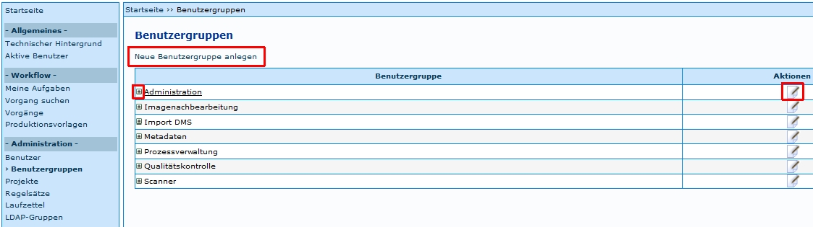

Die Einstiegsseite bietet eine Übersicht über bereits vorhandene Benutzergruppen. Für jede Benutzergruppe werden per Mausklick auf das Symbol  die aktuell zugewiesenen Benutzer angezeigt. Die Benutzergruppen lassen sich in der Spalte *Aktionen* über den Button *Bearbeiten*  editieren. Über den Link *Neue Benutzergruppe anlegen* öffnet sich eine neue eingabemaske zum Anlegen einer neuen Benutzergruppe.

 

*Neue Benutzergruppe anlegen*

Zum Anlegen einer neuen Benutzergruppe ist ihr Titel das heißt die Benennung dieser Gruppe einzutragen. Der Titel einer Benutzergruppe ist  von jedem Anwender frei wählbar, sollte aber innerhalb eines Systems einheitlich verwendet werden. Jeder Benutzergruppe ist aus dem Dropdown Menü eine Berechtigungsstufe zuzuweisen. Diese Stufen werden vom System bereit gestellt, siehe Kapitel [Berechtigungsstufen](Berechtigungsstufen).

