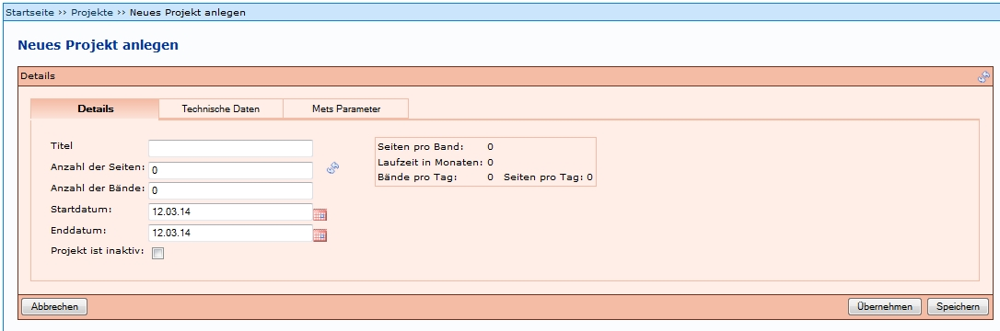
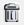
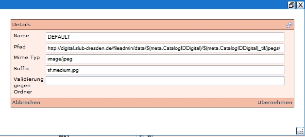
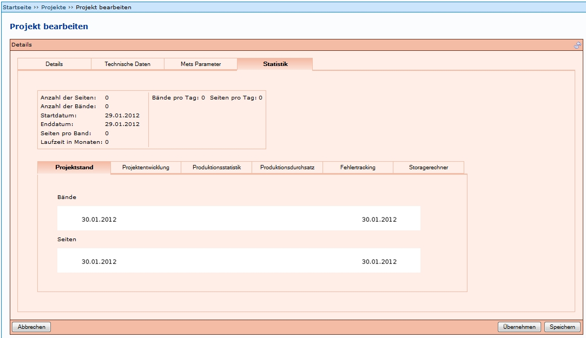

# Einleitung

[Projekte](Projekt.md) dienen der Verwaltung von Digitalisierungsprojekten. Um dies zu ermöglichen, sind mehrere Einstellungen notwendig. Darunter unter anderem die Speicherorte für die Metadaten und Images, die Bildung der PURL, die URL des Rechteinhabers, und weitere. Diese werden in den folgenden Abschnitten erläutert. 

Die Einstiegsseite unter dem Menüpunkt *Projekte* bietet eine Übersicht über bereits vorhandene Projekte. Diese lassen sich in der Spalte *Aktionen* über den Button Bearbeiten  editieren. Über den Link *Neues Projekt anlegen* öffnet sich die Tabelle zur Definition eines neuen Projektes.

# Neues Projekt anlegen

Die Angaben für ein neues Projekt sind auf mehrere Menüpunkte aufgeteilt, die im Folgenden einzeln erläutert werden:

* Details
* Technische Daten
* Mets Parameter
* Statistik

Bei den meisten Feldern empfiehlt es sich, sich an bestehenden Projekten (falls vorhanden) zu orientieren. Zudem muss beachtet werden, dass in der Konfigurationsdatei _goobi_digitalCollections.xml_ die Projekte eingetragen müssen (siehe [Installationsanleitung](Installationsanleitung.md)). Wenn dies nicht gemacht wird, werden keine Digitale Kollektionen beim Anlegen eines Vorgangs angezeigt. Da zumindest eine Kollektion gewählt werden muss, wäre das Anlegen des Vorgangs somit nicht möglich. 
Eine Beispiel _goobi_digitalCollections.xml_-Datei findet sich unter [https://github.com/kitodo/kitodo-production/tree/1.11.x/Goobi/config](https://github.com/kitodo/kitodo-production/tree/1.11.x/Goobi/config). 

Einige Angaben müssen in der sogenannten goobi_projects.xml-Datei hinterlegt sein und können nicht über das Frontend eingegeben werden. Erläuterungen zu der goobi_projects.xml-Datei finden sich unter [Projekt XML Datei](Projekt-XML-Datei.md). 

Es ist nicht möglich, allgemein gültige Feldbelegungen zu nennen. Diese hängen von den Bedingungen in den jeweiligen Institutionen ab. In dieser Dokumentation können Inhalte nur **beispielhaft** genannt werden.   

## Details

Hier sind die Parameter für jedes Projekt einzutragen. Besondere Relevanz besitzt die Angabe des Titels. Dieser dient später bei der Verknüpfung zwischen Benutzer, Produktionsvorlage und Projekt zur Identifizierung des Projektes. Der Titel sollte keine Leerzeichen oder Umlaute enthalten, um spätere Probleme im Dateisystem zu vermeiden (Abarbeitung von Batch-Scripten o.ä.).

## Technische Daten

Folgende Felder können belegt werden: 

_Internes Speicherformat_ 

Dies gibt das Format an, welches zur internen Speicherung in Kitodo.Production angewendet wird. Es ist möglich zwischen Mets und XStream zu wählen. Siehe Anhang unten zur Erläuterung der Formate. 

_DMS Exportformat_ 

Dies gibt das Format an, welches zum Export aus Kitodo.Production angewendet wird. Siehe Anhang unten zur Erläuterung der Formate. 

_Automatischer DMS-Export_

Wenn dieses Feld mit einem Haken aktiviert wird, wird der Export automatisch ausgelöst, sofern alle weiteren Einstellungen korrekt vorgenommen wurden. 

_DMS-Export-Ordner für XML-Datei_

Hier wird der Verzeichnis-Pfad zu dem Speicherort eingetragen, an dem die XML-Datei (Metadatendatei) nach dem Export gespeichert wird. 

_DMS-Export-Images-Ordner_

Hier wird der Verzeichnis-Pfad zu dem Speicherort eingetragen, an dem die Images nach dem Export gespeichert werden. 

_DMS-Export-Success-Ordner_

Es gibt bislang keine Informationen über diesen Ordner. Wenn Institutionen diesen nutzen, kann dies hier ergänzt werden. Dieses Feld kann leer gelassen werden. 

_DMS-Export-Error-Ordner_

Es gibt bislang keine Informationen über diesen Ordner. Wenn Institutionen diesen nutzen, kann dies hier ergänzt werden. Dieses Feld kann leer gelassen werden. 

_Erzeuge Vorgangsordner_

Wenn dieses Feld mit einem Haken aktiviert wird, wird im definierten "DMS-Export-Ordner für XML-Datei" oder "DMS-Export-Images-Ordner" noch ein Unterverzeichnis, benannt nach dem Prozesstitel, erzeugt.

_Zeitüberschreitung (ms)_

Hier kann festgelegt werden, wie lange ein Export maximal laufen kann. 

In der SLUB werden unter Technische Daten nur die Felder Internes Speicherformat und DMS Exportformat mit Mets ausgefüllt. 

Wenn die Vorgänge dieses Projekts automatisch exportiert werden sollen, muss

* bei *Automatischer DMS-Export* ein Haken gesetzt werden
* bei *Erzeuge Vorgangsordner* ein Haken gesetzt werden 
* bei *DMS-Export-Ordner für XML-Datei* der entsprechende Pfad eingetragen werden
* bei *DMS-Export-Images-Ordner* der entsprechende Pfad eingetragen werden

Siehe auch: [Export](Export.md).

## METS Parameter

 

Die Inhalte der Felder sind für den METS-Export notwendig und müssen in jeder Institution bestimmt werden. Sie können aber für weitere Projekte nachgenutzt werden, wenn sich zum Beispiel die Rechtesituation nicht ändert. 

Folgende Felder können belegt werden: 

_METS Rechteinhaber_

Hier wird der offizielle Name der Institution eingetragen, die die Rechte an den Dokumenten hält. 

_METS Rechteinhaber Logo_

Hier wird der Verzeichnis-Pfad zu dem Speicherort eingetragen, an dem das Logo des Rechteinhabers vorgehalten wird. Dieser Pfad kann auch dafür genutzt werden, dass im DFG-Viewer das Logo der Institution angezeigt wird, die das Digitalisat bereitstellt. 

_METS Rechteinhaber URL_

Hier wird die URL der Webseite des Rechteinhabers eingetragen. 

_METS Rechteinhaber Kontakt_

Hier wird eine gültige E-Mail-Adresse des Rechteinhabers eingetragen. 

_METS Digiprov Referenz_

Hier wird der Pfad eingegeben, der auf den Nachweis des Digitalisats führt. Dies kann zum Beispiel ein Katalog sein. 

Der Pfad kann aus zwei Elementen erstellt werden: Einem festen Prefix (zum Beispiel: _http://dienste.slub-dresden.de/cgi-bin/FOZK.pl?PPN=_) und einer Variablen, die automatisch durch den eindeutigen Identifier (zum Beispiel: _$(meta.topstruct.CatalogIDDigital)_) ersetzt werden kann. Der Identifier besteht in diesem Beispiel aus der ID der Titelaufnahme im genutzten Katalog (SWB).

_METS Digiprov Präsentation_

Hier wird der Pfad eingegeben, der zu dem Digitalisat führt. 

Der Pfad kann aus zwei Elementen erstellt werden: Einem festen Prefix (zum Beispiel: _http://digital.slub-dresden.de/id_) und einer Variablen, die automatisch durch den eindeutigen Identifier (zum Beispiel: _meta.CatalogIDDigital_) ersetzt werden kann. Der Identifier besteht in diesem Beispiel aus der ID der Titelaufnahme im genutzten Katalog (SWB).

_METS Digiprov Referenz (Anker)_ 

Hier wird der Pfad eingegeben, der auf den Nachweis der Gesamtheit des Digitalisats (Anker) führt. Dies kann zum Beispiel ein Katalog sein. 

In der SLUB wird dieser Pfad zusammengesetzt wie derjenige in _METS Digiprov Referenz_. 

_METS Digiprov Präsentation (Anker)_

Hier wird der Pfad eingegeben, der auf die Gesamtheit des Digitalisats (Anker) führt. Dies kann zum Beispiel ein Katalog sein. 

In der SLUB wird dieser Pfad zusammengesetzt wie derjenige in _METS Digiprov Präsentation_. 

_METS Pointer Pfad_

Hier wird der Pfad eingegeben, der in der meta.xml-Datei eines Bandes in dem Element `<mets:mptr>` in `<mets:structMap TYPE="LOGICAL">` eingetragen wird. Dies muss der Pfad zur meta_anchor.xml sein, um die Verknüpfung zur meta_anchor.xml-Datei herzustellen. 

Der Pfad wird zusammengesetzt aus einem Prefix (zum Beispiel: http://digital.slub-dresden.de/fileadmin/data/), einer Variablen, die automatisch durch den eindeutigen Identifier (zum Beispiel: _meta.CatalogIDDigital_) ersetzt werden kann und einem Suffix (_anchor).

Beispiel SLUB: 

`http://digital.slub-dresden.de/fileadmin/data/20050662Z/20050662Z_anchor.xml"/`

Je nach Institution wird dieser Link unterschiedlich gebildet. 

_METS Pointer Pfad (Anker)_

Hier wird der Pfad eingegeben, der in der meta_anchor.xml-Datei eines Bandes in dem Element `<mets:mptr>` in `<mets:structMap TYPE="LOGICAL">` eingetragen wird. Dies muss der Pfad zur meta.xml sein, um die Verknüpfung zur jeweiligen meta.xml-Datei herzustellen. 

Der Pfad wird zusammengesetzt aus einem Prefix (zum Beispiel: http://digital.slub-dresden.de/fileadmin/data/) und einer Variablen, die automatisch durch den eindeutigen Identifier (zum Beispiel: _meta.CatalogIDDigital_) ersetzt werden kann.

Beispiel SLUB: 

`http://digital.slub-dresden.de/fileadmin/data/20050662Z/20050662Z.xml"/`

Je nach Institution wird dieser Link unterschiedlich gebildet. 

_METS PURL (logische Struktur)_

Hier wird die Struktur der PURL der Digitalisate festgelegt. Diese besteht aus einem zu definierenden Prefix (zum Beispiel: _http://digital.slub-dresden.de/id_) und einem automatisch ergänzten eindeutigen Identifier (zum Beispiel: _$(meta.CatalogIDDigital)_). Der Identifier besteht in diesem Beispiel aus der ID der Titelaufnahme im genutzten Katalog (SWB). 

_METS ContentIDs (physische Struktur)_

Dazu liegen keine gesicherten Erkenntnisse vor. 

**Beispiel**: Hier zum Beispiel in dem Bereich Rechte (RIGHTS): 

---
	<mets:rightsMD ID="RIGHTS">
		<mets:mdWrap MDTYPE="OTHER" MIMETYPE="text/xml" OTHERMDTYPE="DVRIGHTS">
			<mets:xmlData>
				<dv:rights>
					<dv:owner>
					Sächsische Landesbibliothek - Staats- und Universitätsbibliothek Dresden
					</dv:owner>
					<dv:ownerLogo>
					http://digital.slub-dresden.de/fileadmin/images/dfgviewer_logo_slub.gif
					</dv:ownerLogo>
					<dv:ownerSiteURL>
					http://www.slub-dresden.de/
					</dv:ownerSiteURL>
					<dv:ownerContact>
					mailto:sebastian.meyer@slub-dresden.de
					</dv:ownerContact>
				</dv:rights>
			</mets:xmlData>
		</mets:mdWrap>
	</mets:rightsMD>
---

**Beispiel**: Hier zum Beispiel in den Bereich Digitale Herkunftsangaben (DIGIPROV): 

---
	<mets:digiprovMD ID="DIGIPROV">
		<mets:mdWrap MDTYPE="OTHER" MIMETYPE="text/xml" OTHERMDTYPE="DVLINKS">
			<mets:xmlData>
				<dv:links>
					<dv:reference>
					http://dienste.slub-dresden.de/cgi-bin/FOZK.pl?PPN=38192260X
					</dv:reference>
					<dv:presentation>
					http://digital.slub-dresden.de/id38192260X-19030000
					</dv:presentation>
				</dv:links>
			</mets:xmlData>
		</mets:mdWrap>
	</mets:rightsMD>
---

Weiterführende Informationen über METS finden sich unter [METS: Überblick und Anleitung](http://www.loc.gov/standards/mets/METSOverview.v2_de.html). In dem Bereich [Verwaltungsangaben (Administrative Metadata)](http://www.loc.gov/standards/mets/METSOverview.v2_de.html#admMD) werden die Elemente `<rightsMD>` und `<digiprovMD>` vorgestellt. 

_METS Dateigruppen_

Unter *Mets Dateigruppen* werden Angaben zur Bereitstellung der Images, beziehungsweise des Volltextes in der Präsentation eingegeben. Diese Dateigruppen orientieren sich an den DFG Praxisregeln. Es handelt sich um diese: 

* DEFAULT
* DOWNLOAD
* FULLTEXT
* MAX
* MIN
* ORIGINAL
* THUMBS

Jede Dateigruppe muss mit zusätzlichen Informationen angereichert werden: 

_Name_

In diesem Feld wird der Name der Dateigruppe eingetragen. Dieser sollte die Art der Gruppe beschreiben, wie zum Beispiel THUMBS für Vorschaubilder oder FULLTEXT für Volltext-Dateien. 

_Pfad_

In diesem Feld wird der Pfad eingetragen, der den Ort benennt, an dem die Dateien gespeichert werden. Dies ist notwendig, um in der METS-Datei die Dateiverlinkungen abbilden zu können. Der Identifier muss hier als Variable angegeben werden (zum Beispiel _$(meta.CatalogIDDigital)_)!  

_Mime Typ_

In diesem Feld wird angegeben um welche Datei es sich handelt. "image/jpeg" zum Beispiel gibt an, dass es sich um eine Bilddatei im JPG-Format handelt. 

_Suffix_

In diesem Feld wird eingetragen, wie der Pfad enden soll, zum Beispiel "tif.medium.jpg" 

_Validierung gegen Ordner_

Für den Inhalt dieses Felds gibt es keine gesicherten Erkenntnisse.  

In der METS-Datei sieht das Ergebnis zum Beispiel so aus: 

**Beispiel**: Dateigruppe FULLTEXT: 

---
	<mets:file ID="FILE_0096_FULLTEXT" MIMETYPE="text/xml">
	<mets:FLocat LOCTYPE="URL" xlink:href="http://digital.slub-dresden.de/fileadmin/data/351392440/351392440_ocr/00000096.xml"/>
	</mets:file>
---

**Beispiel**: Dateigruppe MEDIUM: 

---

	<mets:file ID="FILE_0046_DEFAULT" MIMETYPE="image/jpeg">
	<mets:FLocat LOCTYPE="URL" xlink:href="http://digital.slub-dresden.de/fileadmin/data/38192260X-19030000/38192260X-19030000_tif/jpegs/00000046.tif.medium.jpg"/>
	</mets:file>

---

**Beispiel**: Dateigruppe ORIGINAL: 

---

	<mets:file ID="FILE_0113_ORIGINAL" MIMETYPE="image/jpeg">
	<mets:FLocat LOCTYPE="URL" xlink:href="http://digital.slub-dresden.de/fileadmin/data/364572701-19231000/364572701-19231000_tif/jpegs/00000096.tif.original.jpg"/>
	</mets:file>

---

Über Dateigruppe hinzufügen kann eine Gruppe hinzugefügt werden. Über das Symbol  lässt sich eine vorhandene Gruppe bearbeiten, bzw. über das Symbol  löschen. Die Angaben müssen in jeder Einrichtung festgelegt werden. Es könnte zum Beispiel so aussehen:

## Statistik

Unter Statistik lassen sich unterschiedliche statistische Daten eines Projektes auswerten.

# Anhang: Informationen zu Datenformate aus dem früheren Goobi Wiki

Goobi unterstützt in der Version 1.5.1. insgesamt drei unterschiedliche Dateiformate. Diese können sowohl für die interne Speicherung in Goobi verwendet werden als auch für den Export in das Dokumenten-Management-System.

RDF

Beim RDF-Format handelt es sich um ein älteres proprietäres XML-Format, das sämtliche Struktur- und Metadaten sowie die Paginierungen weitestgehend abbilden kann. Problematisch ist dieses Format lediglich im Hinblick auf spezielle Paginierungssequenzen. Insbesondere bei der Blatt- und Spaltenzählung können die besonderen Zählweisen nicht durch dieses Format gespeichert werden, so dass die Paginierungssequenzen verloren gehen. Die Speicherung von der verbreiteten Seitenzählung ist jedoch vollkommen unproblematisch durch RDF.

Update Februar 2016: Dies ist obsolet und soll sollte nicht genutzt werden. Er diente früher dem Export von AgoraXML. 
Siehe auch [Regelsatz XML Datei](Regelsatz-XML-Datei.md)

xStream

Das Format xStream ist xml Serialisierung von kompletten Java-Objekten. Bei diesem Format handelt es sich um eine vollständige Speicherung aller Informationen, die zur Struktur- und Metadatenerfassung sowie zur Paginierung erfasst wurden, ohne dass diese in ein spezielles standardisiertes Format überführt werden. Das Format xStream ist daher für manuelle Änderungen und Nachnutzbarkeit in anderen Systemen am wenigsten geeignet. Es sollte ausschließlich für die interne Speicherung verwendet werden. Das Format wir in einer der nächsten Versionen deaktiviert.

METS

Das METS-Format wurde mit Goobi 1.5.1 erstmals vollständig sowohl für den DMS-Import als auch für die interne Speicherung eingeführt. Dieses verbreitete Format ermöglicht die maximale Nachnutzbarkeit in anderen Systemen. Darüber hinaus können sämtliche Informationen der Struktur- und Metadaten sowie der Paginierungssequenzen inklusive der FileGroups durch dieses Format abgebildet werden. Es ist das für den DMS-Import am besten geeignete Format. Auch für eine interne Speicherung in Goobi wird die Nutzung des METS-Formates empfohlen.

# Weitere Informationen
Tutorial: [Projekt anlegen](https://github.com/kitodo/kitodo-tutorials/blob/master/kitodo2/02_projekt-anlegen.md)