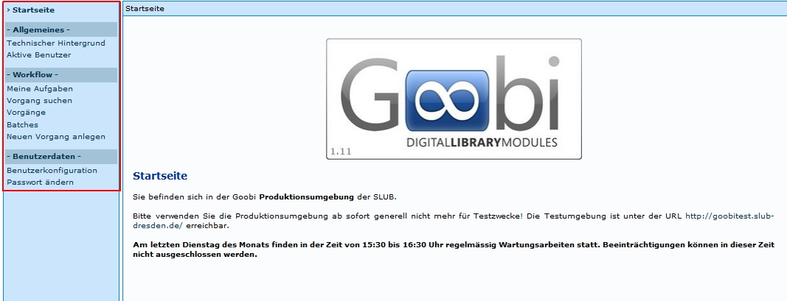
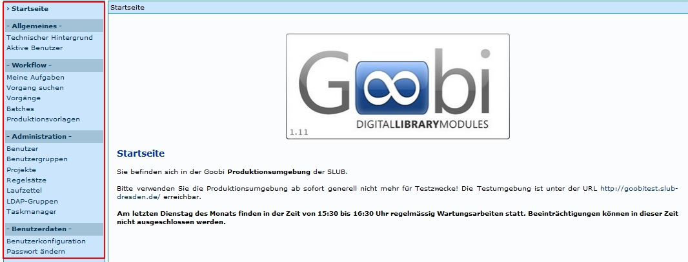

Die Startseite bietet dem Benutzer die Funktionen an, die ihm durch die Berechtigungsstufen zugewiesen sind.       

**Einfache Nutzerberechtigung**

* Startseite 
* Technischer Hintergrund
* Aktive Benutzer
* Meine Aufgaben
* Vorgang suchen
* Benutzerkonfiguration
* Passwort ändern

**Verwaltung**

* Startseite 
* Technischer Hintergrund
* Aktive Benutzer
* Meine Aufgaben
* Vorgang suchen
* Vorgänge 
* Batches
* Neuen Vorgang anlegen
* Benutzerkonfiguration
* Passwort ändern

**Administration**

* Startseite 
* Technischer Hintergrund
* Aktive Benutzer
* Meine Aufgaben
* Vorgang suchen
* Vorgänge 
* Batches
* Neuen Vorgang anlegen
* Benutzer
* Benutzergruppen
* Projekte
* Regelsätze
* Laufzettel
* LDAP-Gruppen
* Taskmanager
* Benutzerkonfiguration
* Passwort ändern

**Erläuterung**

* Startseite

  Dieser Link führt zum Startbildschirm.  

* Technischer Hintergrund

  Dieser Link führt zu der Seite, auf der der technische Hintergrund und Grundfunktionalität beschrieben ist.

* Aktive Benutzer

  Dieser Link führt zu der Seite, auf der alle aktiven Benutzer angezeigt werden. 

* Meine Aufgaben

  Dieser Link führt zu der Seite, auf der alle offenen Aufgaben des Benutzers angezeigt werden. Die Anzahl der Aufgaben hängt von der Zahl der Projekte und Aufgaben ab, die dem Benutzer zugewiesen sind. 

* Vorgang suchen

  Dieser Link führt zu der Seite, auf der Vorgänge gesucht werden können. Zudem wird hier der Workflow angezeigt. 

* Vorgänge

  Dieser Link führt zu der Seite, auf der alle Vorgänge angezeigt werden. 

* Batches

  Zu dieser Funktion können keine Aussagen getroffen werden. 

* Produktionsvorlagen / neuen Vorgang anlegen

  Dieser Link führt zu der Seite, auf der alle verfügbaren Produktionsvorlagen angezeigt werden. 

* Benutzer

  Dieser Link führt zu der Seite, auf der alle registrierten Benutzer angezeigt werden.

* Benutzergruppen

  Dieser Link führt zu der Seite, auf der alle verfügbaren Benutzergruppen angezeigt werden.

* Projekte

  Dieser Link führt zu der Seite, auf der alle verfügbaren Projekte angezeigt werden.

* Regelsätze

  Dieser Link führt zu der Seite, auf der alle verfügbaren Regelsätze angezeigt werden.

* Laufzettel

  Dieser Link führt zu der Seite, auf der alle verfügbaren Laufzettel angezeigt werden.

* LDAP-Gruppen

  Dieser Link führt zu der Seite, auf der alle verfügbaren LDAP-Gruppen angezeigt werden.

* Taskmanager

  Dieser Link führt zu der Seite, auf der die lang laufenden Aufgaben (Export, OCR, ...) angezeigt werden.

* Benutzerkonfiguration

  Dieser Link führt zu der Seite, auf der Benutzerdefinierte Einstellungen vorgenommen werden können.

* Passwort ändern

  Dieser Link führt zu der Seite, auf der das Passwort geändert werden kann.