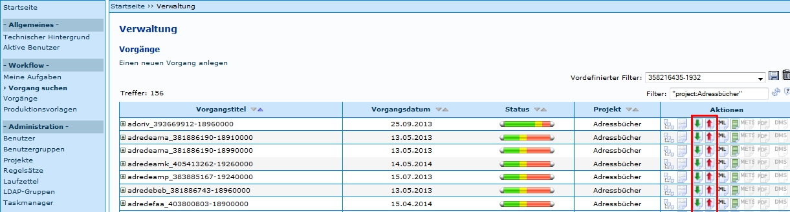

Jeder Benutzer in Kitodo.Production verfügt über ein Homeverzeichnis. Dies ist ein Verzeichnis auf dem Server, das nur mit den Logindaten des Benutzers erreicht werden kann. Wenn die Adresse bekannt ist, lässt sich dieses Verzeichnis über den Windows-Explorer oder gleichwertige Programme erreichen.

Die Verlinkung mit dem Homeverzeichnis ermöglicht es, dass die Images eines Vorgangs eingefügt/gelöscht/bearbeitet werden können. Ein Vorgang kann auf unterschiedliche Weise mit dem Homeverzeichnis verlinkt werden:

* Meine Aufgaben
* Administrativ 
 

### Meine Aufgaben:

Bei bestimmten Arbeitschritten wie Scannen wird es durch Einstellungen in den [Aufgabendetails](Bearbeitung-Aufgabe) ermöglicht, dass mit der Übernahme einer Aufgabe die Verlinkung automatisch hergestellt und mit Abgabe der Aufgabe wieder getrennt wird.

### Administrativ:

In der Trefferliste unter "Vorgang suchen", können über die [Aktionen](Aktionen) des roten und grünen Pfeils die Verlinkung hergestellt, bzw. entfernt werden.

