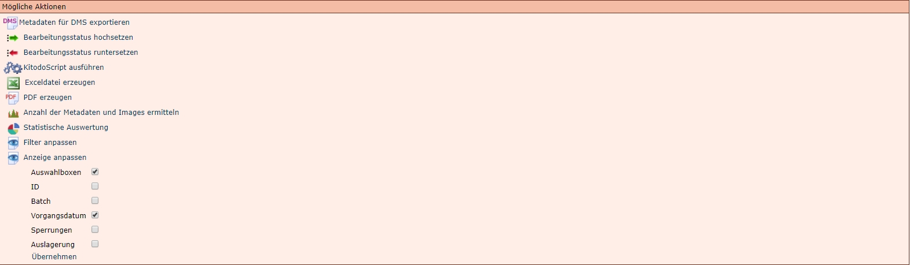
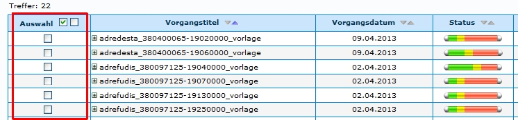
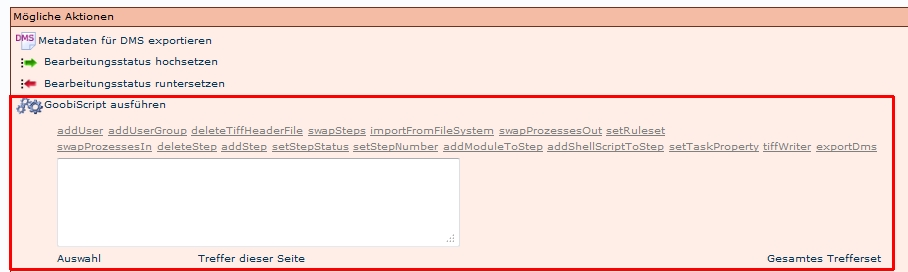

# Einleitung

KitodoScripte dienen dazu, eine Aktion an mehreren Vorgängen durchzuführen, anstatt jeden Vorgang an sich bearbeiten zu müssen. 

# Schritt 1: Vorgänge suchen

Führen Sie zunächst eine [Suche](Suche-und-Filtern.md) durch, die genau die Vorgänge als Treffer anzeigen wird, die bearbeitet werden sollen. Wenn es nicht möglich ist, die Treffermenge durch die Suche exakt zu beschränken, kann Schritt 2 durchgeführt werden. 

# Schritt 2: Vorgänge selektieren

Soll das KitodoScript nicht auf das gesamte Trefferset oder auf die gesamte Trefferseite angewendet werden, müssen zunächst die gewünschten Vorgänge aus dem Trefferset markiert werden. Dies erreicht man, indem zunächst unterhalb des Treffersets die Aktion "Anzeige anpassen" aufgerufen und dort die *Auswahlboxen* markiert werden.

Ein Klick auf *Übernehmen* lädt anschliessend die Seite neu. so dass im Trefferset nun die Auswahlboxen angezeigt werden, mittels denen nun eine Selektion erfolgen kann.

**ACHTUNG!**: Es muss unbedingt darauf geachtet werden, dass nur die Vorgänge markiert sind, die tatsächlich durch das Script bearbeiten werden sollen. Einige Funktionen können nicht rückgängig gemacht werden.

# Schritt 3: KitodoScript auswählen

Wenn die Vorgänge, die bearbeitet werden sollen, korrekt ausgewählt wurden, muss das Script ausgewählt werden, das ausgeführt werden soll. 

## Auslösen der Scripte

Mit folgenen Befehlen wird das Script ausgelöst:

* *Auswahl*: Das Script wird bei den Vorgängen angewendet, die mit den Auswahlboxenmarkiert wurden.

* *Treffer dieser Seite*: Das Script wird bei den Vorgängen angewendet, die auf der Seite angezeigt werden.

* *Gesamtes Trefferset*: Das Script wird bei allen Vorgängen des Treffersets angewendet, also auch Vorgänge, die nicht auf der Seite angezeigt werden, wenn die Vorgangsliste so lange ist, dass es mehrere Listen gibt.

## Mögliche Scripte

Es werden mehrere Scripte zur Auswahl angeboten. Im Folgenden werden diese mit dem zugehörigen Befehl aufgelistet. Aufgrund mangelnder Erfahrung wird in den meisten Fällen auf eine Beschreibung verzichtet.

Großgeschriebene Textteile (TITLE_STEP, USER_NAME,...) sind Variable, die vor der Anwendung des Scripts durch den entsprechenden Wert (Bezeichnung eines bestimmten Schritts, Name eines Benutzers) ersetzt werden müssen.

 
### addUser
Skriptname: *addUser*

Script: `action:addUser "steptitle:TITLE_STEP" username:USER_NAME`

Erläuterung: Mit diesem Befehl kann den Vorgängen eines Treffersets einer Aufgabe ein bestimmter Benutzer zugewiesen werden. 

### addUserGroup
Skriptname: *addUserGroup*

Script: `action:addUserGroup "steptitle:TITLE_STEP" group:GROUP_NAME`

Erläuterung: Mit diesem Befehl kann den Vorgängen eines Treffersets einer Aufgabe eine bestimmte Benutzergruppe zugewiesen werden. 

### deleteTiffHeaderFile
Skriptname: *deleteTiffHeaderFile*

Script:	`action:deleteTiffHeaderFile`

Erläuterung: Zu diesem Befehl liegen keine gesicherten Informationen vor. 

### swapSteps
Skriptname: *swapSteps*

Script:	`action:swapSteps swap1nr:ORDER_NUMBER_FIRST_STEP "swap1title:TITLE_FIRST_STEP"swap2nr:ORDER_NUMBER_SECOND_STEP "swap2title:TITLE_SECOND_STEP"`

Erläuterung: Zu diesem Befehl liegen keine gesicherten Informationen vor.

### importFromFileSystem
Skriptname: *importFromFileSystem*

Script:	`action:importFromFileSystem sourcefolder:SOURCE_FOLDER`

Erläuterung: Zu diesem Befehl liegen keine gesicherten Informationen vor.

### swapProzessesOut
Skriptname: *swapProzessesOut*

Script: `action:swapProzessesOut`

Erläuterung: Zu diesem Befehl liegen keine gesicherten Informationen vor. -> Das Script scheint nicht zu funktionieren: https://bugs.launchpad.net/goobi-production/+bug/789027

### setRuleset
Skriptname: *setRuleset*

Script:	`action:setRuleset "ruleset:TITLE_RULESET"`

Erläuterung: Mit diesem Befehl kann den Vorgängen eines Treffersets ein anderer Regelsatz zugewiesen werden. 

### swapProzessesIn
Skriptname: *swapProzessesIn*

Script:	`action:swapProzessesIn`

Erläuterung: Zu diesem Befehl liegen keine gesicherten Informationen vor.

### deleteStep
Skriptname: *deleteStep*

Script:	`action:deleteStep "steptitle:TITLE_STEP"`

Erläuterung: Mit diesem Befehl kann in den Vorgängen eines Treffersets eine Aufgabe gelöscht werden.

### addStep
Skriptname: *addStep*

Script:	`action:addStep "steptitle:TITLE_STEP" number:NUMBER_1_TO_?`

Erläuterung: Mit diesem Befehl kann den Vorgängen eines Treffersets eine weitere Aufgabe und deren Reihenfolge hinzugefügt werden. 

### setStepStatus
Skriptname: *setStepStatus*

Script:	`action:setStepStatus "steptitle:TITLE_STEP" status:NUMBER_0_TO_3`

Erläuterung: Mit diesem Befehl kann in den Vorgängen eines Treffersets der Status einer Aufgabe geändert werden. 

- `0` = Gesperrt
- `1` = Offen
- `2` = In Bearbeitung
- `3` = Abgeschlossen

### setStepNumber
Skriptname: *setStepNumber*

Script: `action:setStepNumber "steptitle:TITLE_STEP" number:NUMBER_1_TO_?`

Erläuterung: Mit diesem Befehl kann in den Vorgängen eines Treffersets die Reihenfolge (Nummer) einer Aufgabe geändert werden. 

### addModuleToStep
Skriptname: *addModuleToStep*

Script: `action:addModuleToStep "steptitle:TITLE_STEP" "module:MODULE_NAME"`

Erläuterung: Zu diesem Befehl liegen keine gesicherten Informationen vor.

### addShellScriptToStep
Skriptname: *addShellScriptToStep*

Script: `action:addShellScriptToStep "steptitle:TITLE_STEP" "label:LABEL_FOR_SCRIPT" "script:PATH_TO_SCRIPT"`

Erläuterung: Mit diesem Befehl kann in den Vorgängen eines Treffersets der "Script Schritt" in den [Eigenschaften einer Aufgabe](Aufgaben-Einstellungen.md) geändert werden. 

- `label` = Skriptname
- `script` = Skriptpfad

### setTaskProperty
Skriptname: *setTaskProperty*

Script: `action:setTaskProperty "steptitle:TITLE_STEP" property:metadata_readimages_writeimages_validate_exportdms_automatic_batch value:true_OR_false`

Erläuterung: Mit diesem Befehl kann in den Vorgängen eines Treffersets die [Eigenschaften einer Aufgabe](Aufgaben-Einstellungen.md) geändert werden. 

Folgende Aufgabeneigenschaften können aktiviert / deaktiviert werden:
- `metadata` = Metadaten
- `readimages` = Images lesen
- `writeimages` = Images schreiben
- `validate` = Beim Abschließen verifizieren
- `exportdms` = Export DMS
- `automatic` = Automatische Aufgabe
- `batch` = Batch Schritt

Aktivierung/Deaktivierung
- `value:true` = Aufgabeneigenschaft wird aktiviert
- `value:false` = Aufgabeneigenschaft wird deaktiviert 

### tiffWriter
Skriptname: *tiffWriter*

Script:	`action:tiffWriter`

Erläuterung: Zu diesem Befehl liegen keine gesicherten Informationen vor.

### export

**ACHTUNG: Dieses Script ist in neuen Kitodo-Versionen nicht mehr unter "KitodoScript ausführen" vorhanden.**

Skriptname: *export*

Script:	`action:export exportImages:{true|false} exportOcr:{false|true}`

Erläuterung: Mit diesem Befehl werden die Vorgänge eines Trefferset exportiert. Über die Parameter `exportImages` und `exportOcr` kann bestimmt werden, ob die Bilddaten und / oder OCR Daten mit exportiert werden oder nicht.

### exportDms
Skriptname: *exportDms*

Script:	`action:exportDms exportImages:false`

Erläuterung: Mit diesem Befehl werden die Vorgänge eines Trefferset mit oder ohne Bilddaten exportiert
- `exportImages:false` = Export **ohne** Bilddaten. 
- `exportImages:true` = Export **mit** Bilddaten. 
