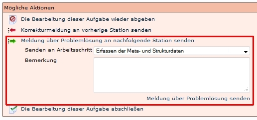

# Einleitung

Korrekturmeldungen dienen dazu, Vorgänge bei Unregelmäßigkeiten auf den vorigen Bearbeitungsstatus zu setzen, beziehungsweise kann bei Klärung der Unregelmäßigkeit die Korrekturmeldung abgeschlosen werden. 

Dieses Verfahren bietet den Vorteil, dass alle Schritte protokolliert werden. Dies ist für Fehleranalysen recht hilfreich.

Zumeist wird die Funktion angeboten, wenn eine Aufgabe übernommen wird. Im folgenden wird der Bearbeitungsablauf bescheieben.

 
# Korrekturmeldung an vorige Station senden

Wenn ein Vorgang wegen einer Korrektur an die vorige Station gesendet werden soll, muss *Korrekturmeldung an vorherige Station senden* betätigt werden.

Danach muss unter *Zurück zu Aufgabe* der jeweilige Arbeitsschritt ausgewählt werden. Optional kann die Beschreibung des Problems/Fehlers hinzugefügt werden.

# Problemlösung an nachfolgende Station senden

Nach dieser Aktion findet der Empfänger den Vorgang wieder in seinen Aufgaben und kann die Korrektur durchführen. Danach wird mit Meldung über *Problemlösung an nachfolgende Station senden* die Korrektur beendet. 

Unter *Senden an Arbeitsschritt* muss der jeweilige Arbeitsschritt ausgewählt werden. Optional kann die Beschreibung der Lösung hinzugefügt werden.

Nach dieser Aktion findet der Empfänger den Vorgang wieder in seinen Aufgaben und kann die Bearbeitung des Vorgangs fortführen.

# Anwendungshinweise SLUB

## Prüfsummendatei
Nach jeder Korrektur muss die Prüfsummendatei neu erstellt werden. 

## Imagenummerierung
Wenn in der SLUB Korrekturmeldungen an das Scannen gesendet werden, muss nach der Korrektur darauf geachtet werden, dass die Imagenummerierung den Anforderungen entspricht. 
Unter [Umbenennung von Images in der SLUB](Umbenennung-von-Images-in-der-SLUB.md) wird der Ablauf skizziert. 

## Aufgabe abgeben/Problemlösung senden
Wenn die LZA Validierungsskripte gestartet werden sollen, darf nicht *Problemlösung an nachfolgende Station senden* ausgelöst werden. Es muss *Die Bearbeitung dieser Aufgabe abschließen* genutzt werden, um die Aufgabe abzuschließen. 

