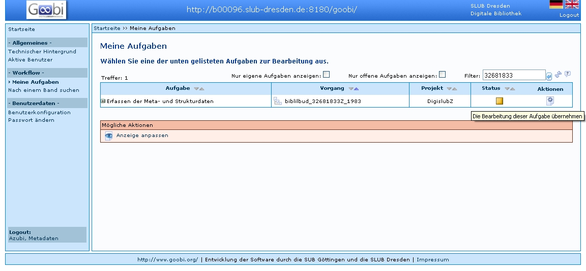
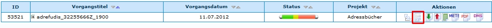
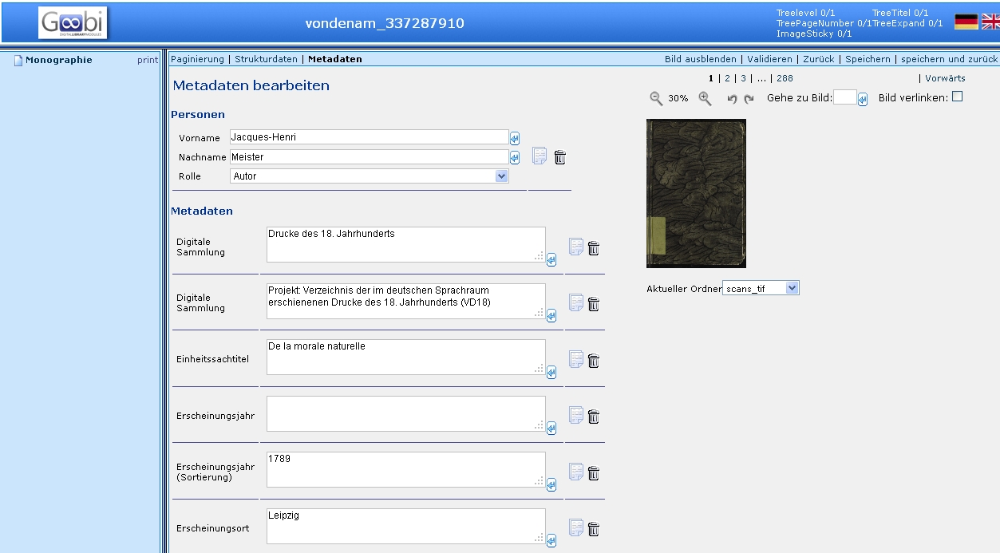
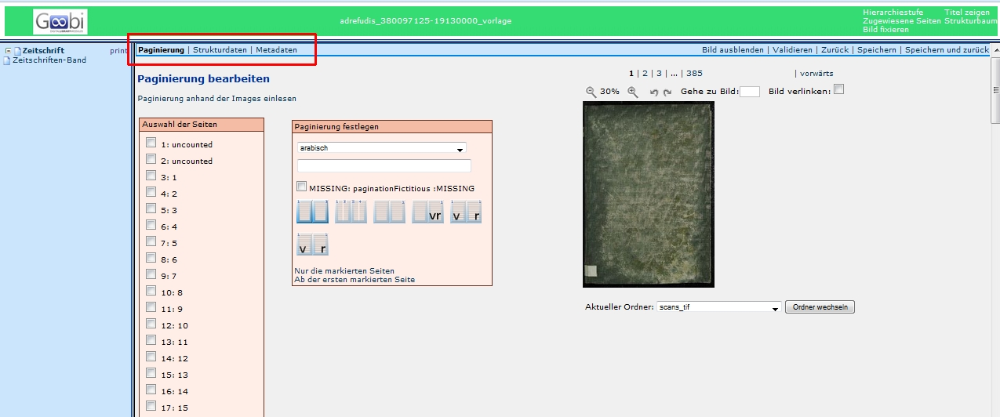
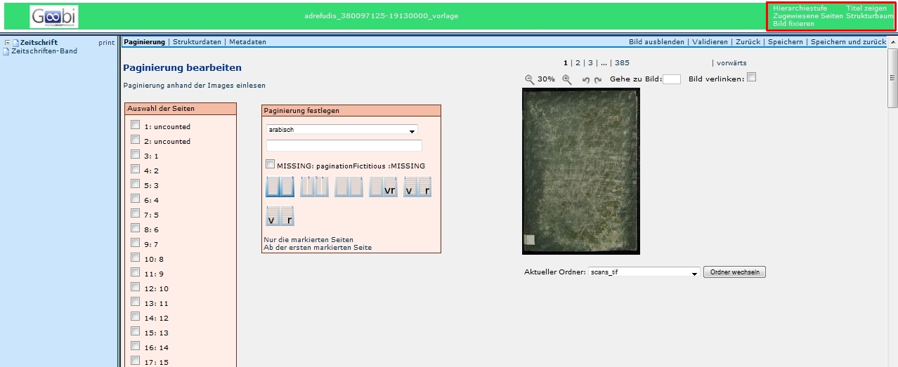
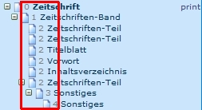
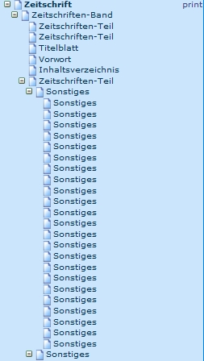
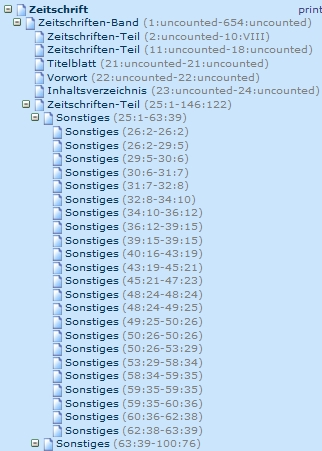
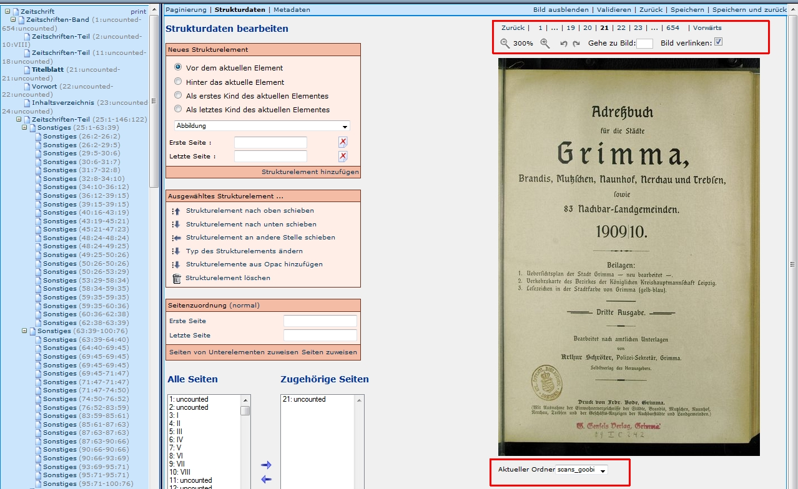
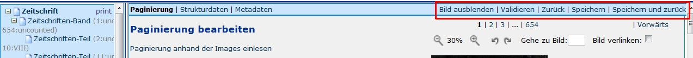

# Einleitung

Ein Kernstück von Kitodo.Production ist der Metadateneditor, da im Gegenteil zu vielen anderen Aufgaben (wie zum Beispiel das Scannen oder der OCR) die Daten direkt eingegeben werden können und keine Daten wie die Images aus anderen Quellen importiert werden. In diesem Editor lassen sich die Images mit Informationen anreichern, so dass die Benutzung vereinfacht wird. Dies beinhaltet:

* Paginieren
* Strukturerfassung
* Metadatenerfassung

Beim Paginieren wird die Seitenzählung des Originals auf die Images des Digitalisats abgebildet. Strukturdaten wie *Kapitel*, *Inhaltsverzeichnis*, ... werden den jeweiligen Images zugewiesen. Je nach Projekt, kann dies sehr umfangreich sein. In aller Regel werden den Strukturdaten auch Metadaten wie zum Beispiel dem Titel eines Kapitels zugewiesen. Diese Metadaten sind später auch recherchierbar.

In den folgenden Abschnitten wird der Aufbau des Metadateneditors und dessen Funktionen beschrieben. 

# Aufrufen des Metadateneditors durch Aufrufen eines Vorgangs

Bevor ein zuvor angelegter Vorgang bearbeitet (paginiert, strukturiert,…) werden kann, muss man ihn erst aufrufen. Dazu gibt es zwei Möglichkeiten:  

* Einloggen
* Linke Menüleiste: *Meine Aufgaben*
* Vorgang aus der Anzeigeliste über Anklicken des Icons *Aktion öffnen*  
* Mögliche Aktionen: *Metadaten bearbeiten*  auswählen

oder:

* Linke Menüleiste: Meine Aufgaben
* Filter: Identifier des Digitalisats eingeben und mit <Enter> Vorgang gezielt anzeigen lassen
* Vorgang aus der Anzeigeliste über Anklicken des Icons  *Aktion öffnen* 
* Mögliche Aktionen: *Metadaten bearbeiten*  auswählen

Es sollte folgende Anzeige auf dem Bildschirm erscheinen:

**ACHTUNG**:

Aufruf eines Vorgangs über Funktion *Nach einem Band suchen / Eingabe der PPN* zeigt den Vorgang unabhängig von der Bearbeitungsstufe an und sollte an dieser Stelle nicht verwendet werden, da der Vorgang gerade von einem anderen Benutzer bearbeitet werden kann. Die Bearbeitung eines solchen Vorgangs durch einen weiteren Benutzer kann zum Verlust der eingegebenen Meta- und Strukturdaten führen.

# Aufbau des Metadateneditors

Nachdem ein Vorgang zum Bearbeiten der Metadaten ausgewählt wurde, öffnet sich der Metadateneditor.

Die Benutzeroberfläche des Metadateneditors besteht aus vier verschiedenen Sektionen:

* Kopfzeile (Header) mit nützlichen Links
* linke Navigationsleiste zur Wiedergabe der Struktur des Titels (Bandes) bzw. Vorganges
* mittlerer Hauptbereich für das Erstellen/Bearbeiten der Meta- und Strukturdaten mit den Arbeitsschritten
	* Metadaten bearbeiten (Vorgangsdaten)
	* Paginierung
	* Strukturdaten anlegen
	* Metadaten anlegen (Strukturdaten)
* rechter Hauptbereich für die Vorschau auf die Digitalisate

**ACHTUNG**:

Der Zurück-Button des Browsers darf während der Bearbeitung nicht verwendet werden, da damit die Bearbeitung eines Vorganges nicht abgeschlossen wird! Der Vorgang bleibt für andere Benutzer gesperrt.

# Funktionen

## Mittlerer Hauptbereich für das Erstellen/Bearbeiten der Meta- und Strukturdaten mit den Arbeitsschritten

* Paginierung
* Strukturdaten
* Metadaten

Diese Funktionen sind die Hauptfunktionen des Metadateneditors. Auf Grund deren Komplexität werden diese in eigenen Abschnitten erläutert.

Anstatt die Links anzuklicken, können auch folgende Shortcuts genutzt werden:

* Strg+Alt+P -> Paginierung
* Strg+Alt+S -> Strukturdaten
* Strg+Alt+M -> Metadaten

## Kopfzeile (Header) mit nützlichen Links

Dieser Bereich befindet sich links oben der Bildschirmanzeige.

 
*Hierarchiestufe*

Wird dieser Text angeklickt, werden im Strukturbaum die Hierarchiestufen der jeweiligen Strukturelemente mit einer arabischen Ziffer angezeigt. 

*Titel zeigen*

Wird dieser Text angeklickt, werden anstatt der Benennung der Strukturelemente der Titel (falls vorhanden) angezeigt. Wenn Metadaten wie der Titel eingeben werden, werden diese nicht sofort in dem Strukturbaum aktuallisiert. Es muss zuvor der Editor geschlossen und erneut aufgerufen werden.

*Zugewiesene Seiten* (zeigt an, welche Seiten und Images den Strukturelementen zugewiesen sind)

Wird dieser Text angeklickt, werden jeweils die ersten und letzten zugewiesenen Seiten und Images des jeweiligen Strukturelements angezeigt.

*Strukturbaum*

Wird dieser Text angeklickt, wird der Strukturbaum bis auf das erste Element reduziert, bzw. werden alle Elemente dargestellt. 

*Bild fixieren*

Wird dieser Text angeklickt, wird der Anzeigeteil im rechten Feld fixiert, so dass es, wie zum Beispiel beim Paginieren nicht mehr aus dem Bild gescrollt wird. 

 
## Einstellungen und Funktionen Bildanzeige:

*Bildgröße* (in Schritten oder Direkteingabe)  300%  

Diese Funktion erlaubt es, die Vorschauimages zu vergrößern, bzw. zu verkleinern. Dies kann in Schritten durch die Lupensymbole oder durch die Eingabe eines Werts in dem Feld zwischen den Lupen durchgeführt werden.

*Bilddrehung*      

Diese Funktion erlaubt es, die Vorschaubilder im Uhrzeigersinn und gegen den Uhrzeigersinn zu drehen.

*Bildauswahl*

Die Bildauswahl kann auf unterschiedliche Weise geändert werden. Zum einen kann auf der Zahlenleiste die Imagenummer angeklickt werden, bzw. kann über *Zurück* und *Vorwärts* immer ein Image vor bzw. zurück gegangen werden. In dem Feld *Gehe zu Bild* kann auch eine konkrete Imagenummer eingegeben werden.

Zudem sind Shortcuts möglich:

	* Strg+Umschalt+ Pfeil (rechts) -> ein Image vor
	* Strg+Umschalt+ Pfeil (links) -> ein Image zurück
	* Strg+Umschalt+ Pfeil (oben) -> 20 Images vor
	* Strg+Umschalt+ Pfeil (unten) -> 20 Images zurück

*Ordnerauswahl*

Diese Funktion ist ggf. nicht in jeder Installation vorhanden. Es ermöglicht es, mit kleineren Images (die zuvor erstellt werden mussten) zu arbeiten, was die Belastung des Netzes verringert und auch den den Wechsel der Images beschleunigt. 

 
## Einstellungen Metadateneditor

*Bild ausblenden*

Werden die Images angezeigt, können sie mit dieser Funktion ausgeblendet werden. Sind die Images ausgeblendet, können sie mit dieser Funktion eingeblendet werden. 

Ein Ausblenden der Images ist in manchen Fällen sinnvoll, da die Ladezeiten 

*Validieren*

Die Metadaten werden auf ihre Gültigkeit überprüft. Sie erhalten im Hauptfeld Informationen bzgl. des Ergebnisses. Es wird geprüft, ob allen Strukturementen Seiten zugewiesen sind, bzw. ob alle Seiten mindestens einem Element zugewiesen sind. Je nach Regelsatz, können weitere Prüfungen hinzugefügt werden.

Ab Version 1.10 wird auch beim Abschließen eines Vorgangs die Validierung durchgeführt. Somit kann die Validierung im Metadateneditor durchgeführt werden, um Fehler zu finden. Es ist jedoch nicht mehr obligatorisch, da die Validierung später durchgeführt wird. Es ist dadurch auch nicht mehr von Bedeutung, wenn das Validieren vergessen wird.

*Speichern*

Die erfassten Daten werden dauerhaft in der *meta.xml* des Vorgangs gespeichert. Dies sollte regelmäßig durchgeführt werden, da Fehlfunktionen des Browsers auch zu Datenverlust führen kann, sollten die Eingaben nicht gespeichert worden sein.

*Speichern und zurück*

Die Daten werden gespeichert und es wird das vorige Fenster agezeigt.

*Zurück*

Geht zurück zum vorigen Fenster. Nicht gespeicherten Daten gehen dadurch verloren, bzw. Änderungen werden nicht übernommen. Diese Funktion sollte in der Regel vermieden werden, kann aber nützlich sein, wenn viele fehlerhafte Daten eingegeben wurden.

# Beenden der Arbeiten im Metadateneditor

Nach Abschluss der Arbeiten im Metadateneditor über *Speichern und zurück* oder *Zurück* sind mehrere Optionen möglich:

Ist die Aufgabe vollständig bearbeitet, kann sie abgeschlossen werden, wodurch der nächste Arbeitsschritt auf offen gesetzt wird. Soll sie später weiter im Metadateneditor bearbeitet werden, darf sie nur abgegeben werden.

