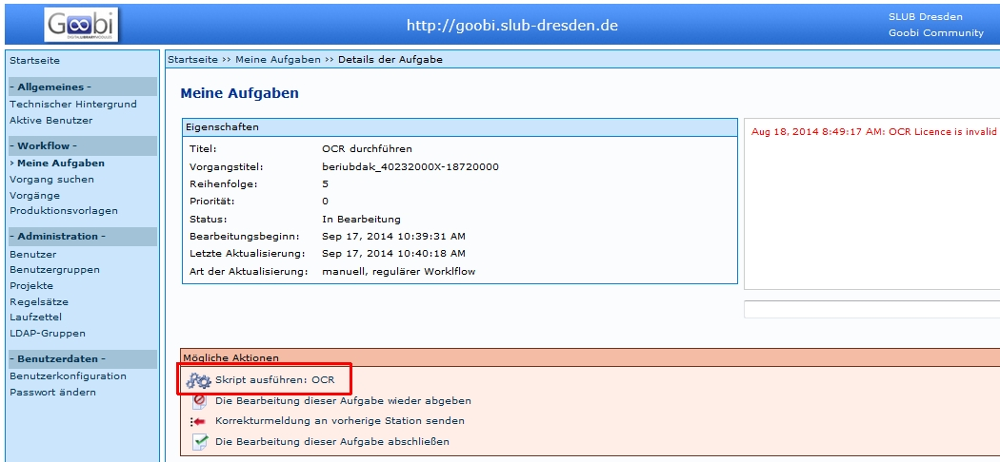

# Einleitung

Zuerst muss festgestellt werden, dass Kitodo.Production über keine eigene OCR-Software verfügt. Die Aufgabe wird aber in der Produktionsvorlage angelegt, um den Status der Aufgabe anzuzeigen. Es können über Skripte unterschiedliche OCR-Dienste eingebunden werden. In der Kitodo Mailing-Liste wurden einige Möglichkeiten erläutert, welche hier im zweiten Abschnitt wiedergegeben werden. Die Bearbeitung der OCR in Kitodo am Beispiel der SLUB wird zuerst erläutert.

# OCR in Kitodo

Diese Beschreibung bezieht sich auf die Einbindung der OCR in der SLUB, die folgende Konstellation anwendet:

* OCR-Service der VZG 
* OCR-Manager der Firma Zeutschel 

Unter diesen Voraussetzungen kann die OCR auf zwei Wegen ausgelöst werden: 

## Automatisches Auslösen der OCR

In Kitodo.Production ist es möglich, dass der OCR-Schritt automatisch ausgeführt wird, sobald der vorige Schritt abgeschlossen ist. Wenn zum Beispiel die Aufgabe *Erfassen der Metadaten* abgeschlossen wird, wird automatisch der Vorgang an den Zeutschel OCR-Manager gesendet. Zudem wird der Status der Aufgabe *OCR durchführen* automatisch nach der erfolgreichen OCR auf abgeschlossen und die folgende Aufgabe auf offen gesetzt.

## Manuelles Auslösen der OCR über "Meine Aufgaben"

Um die OCR in Kitodo.Production zu starten, kann der jeweilige Vorgang mit dem OCR-Schritt unter "Meine Aufgaben" aufgerufen werden.

* Danach wird über *Aktionen* die Aufgabe übernommen.
* Mit dem Befehl *Skript ausführen : OCR* wird die OCR ausgelöst.
* Durch den Befehl *Die Bearbeitung dieser Aufgabe abschließen* wird die Aufgabe abgeschlossen und die folgende Aufgabe nach Beendigung der OCR auf offen gesetzt.

**Achtung**: Unter *Filter anpassen* muss in das Kästchen bei *Automatische Aufgaben anzeigen* ein Haken gesetzt werden.

## OCR-Skript auslösen durch administratives "hochsetzen"

Ist die OCR als automatische Aufgabe definiert, wird bei Statusänderungen von *gesperrt* auf *offen* der Aufgabe *OCR durchführen* die OCR ausgelöst. Hier muss darauf geachtet werden, dass dies nicht unbeabsichtigt ausgelöst wird.
Außerdem ist das Auslösen mehrerer Vorgänge (in einer Trefferliste) in Kitodo.Production zwar theoretisch möglich, häufig wird aber eine Fehlermeldung angezeigt und nur für einen Teil der Vorgänge wird die OCR ausgelöst.

Es wird empfohlen diese Möglichkeit nicht zu nutzen. 

# Technische Realisierung der OCR
## OCR

Als Arbeitsschritt kann in der Workflowsteuerung von Kitodo.Production auch einen OCR-Prozess einbezogen werden. Die OCR an sich wird nicht von Kitodo.Production ausgeführt, sondern stets an ein System außerhalb der Kitodo.Production-Installation weitergereicht. 

Zusätzlich wird noch ein Dienst benötigt, der zwischen Kitodo.Production und der OCR-Software kommuniziert. Dieser Dienst wird in der Regel *Taskmanager* genannt. 

Als Kommunikationsschnittstellen sind bisher folgende bekannt:

* OCR-Webservice des GBV ⇒ OCR-Service der VZG
* Intranda TaskManager ⇒ OCR-Service der VZG oder andere OCR-Dienstleister
* Intranda TaskManager ⇒ Intranda ABBYY OCR Server
* zedOCR ⇒ OCR-Dienstleister

## OCR-Service der VZG

* http://www.gbv.de/Verbundzentrale/serviceangebote/ocr-service-der-vzg

Dort ist zu lesen: Der OCR-Service wird über eine WebDav-Schnittstelle zur Verfügung gestellt und lässt sich somit online zum Beispiel in die Digitalisierungssoftware Kitodo.Production einbinden.

* Göttinger Digitalisierungszentrum (GDZ)
* HSU Hamburg
* TU Braunschweig
* SLUB Dresden : Die SLUB Dresden verwendet den Zeutschel OCR-Manager in Kombination mit dem OCR-Webservice des GBV.
* Intranda GmbH

## Intranda TaskManager

Eine Softwarelösung im Bereich Digitalisierung für die Steuerung von OCR-Prozessen durch einen OCR-Dienstleister.

Vom OCR-Dienstleister werden Einzelseitenergebnisse zurück gesandt und der Intranda TaskManager kann die Daten einstellen (lassen) in Form einer optionalen Dateiausgabe:

* Plaintext-Datei
* Wortkoordinaten-Datei
* ALTO-Format
* TEI-Format
* Seiten-PDF

Diese Dateien werden parallel zu den Bilddateien in einem separaten Ordner auf Kitodo.Production abgespeichert. Die METS-Datei wird dabei in Kitodo.Production zunächst nicht angefaßt. Aber in dem Moment, wo der Export in Richtung METS-Viewer stattfindet, wird ohnehin das METS in die geänderte Export-Form als valides METS geschrieben. In diesem Moment wird geprüft, ob OCR-Ergebnisse vorhanden sind. Wenn ja, werden zusätzliche Dateigruppen (je nach dem, was man alles dort unterbringen möchte) in das METS dazu geschrieben. Kitodo.Production hat damit nichts mehr zu tun. Das Einzige, was Kitodo noch machen kann, ist im Metadateneditor optional den Volltext von dem Bild anzeigen, wenn das OCR schon durchgeführt wurde.

Wenn OCR schon vor dem Arbeitsschritt Erfassung mit Metadateneditor durchgelaufen, könnte man Titel etc. per copy&paste erfassen.

Taskmanager: Das Werk geht in eine Warteschlange. Nach Fertigstellung wird der Vorgang in Kitodo markiert. Der OCR-Prozess geht aber auch selektiv für bestimmte Bände. Beim Anlegen des Bandes in Kitodo wird der Schrifttyp festgelegt (Antiqua, Fraktur, nicht-OCR-fähig) und an den OCR-Dienstleister übergeben.

Man kann den Arbeitsschritt OCR später jederzeit nochmal bzw. erstmalig pro Trefferset über GoobiScript starten.

## Intranda ABBYY OCR Server

Wird angesteuert durch den Intranda TaskManager.

Wird genutzt u. a. von

* Oberösterreichische Landesbibliothek
* Georg-Eckert-Institut

Einige Einrichtungen setzen statt des ABBYY Servers von der Intranda GmbH deren Tesseract Server ein, allerdings zunehmend weniger, seitdem die Preise für ABBYY-OCR durch die direkte Zusammenarbeit von Intranda mit ABBYY deutlich sinken konnten. (20131105)

## ZedOCR

zedOCR im ZED-Server von Zeutschel GmbH ist eine weitere Schnittstelle zwischen OCR-Dienstleister/OCR-Engine und Kitodo.Production

 