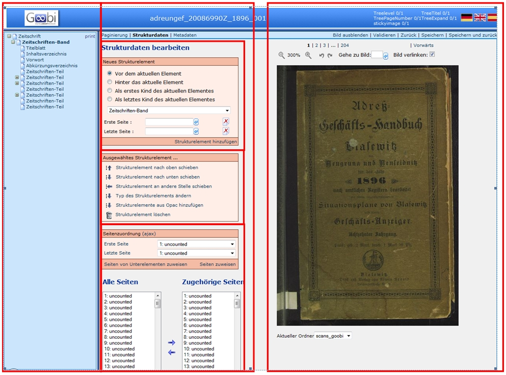

# Allgemeines

Um Strukturdaten erfassen zu können, muss im Metadateneditor der Reiter *Strukturdaten* ausgewählt weren. Die danach erscheinende Ansicht lässt sich in drei Teile gliedern: Linke Seite, Mitte und Rechte Seite:

Linke Seite:

* Die Struktur des Werkes wie als Baumstruktur angezeigt
* übergeordnetes Strukturelement _Monographie_, _Mehrbändiges Werk_ und _Band_ beziehungsweise _Handschrift_ wird automatisch erzeugt
* das Strukturelement, das mit den Funktionen in der Mitte bearbeitet werden kann ist Fett hervorgehoben

Mitte:

* Auswahl und hierarchische Anordnung neuer Strukturelemente
* Änderung der Zuordnung und Reihenfolge von Strukturelementen
* Seitenzuordnung von Images zu einem Strukturelement

Rechte Seite:

* Anzeige der Images
* Einstellungen zur Ansicht (Imagegröße, Bildverlinkung, …)
* Befehlleiste (Speichern, Zurück, Validieren)

Die in _Neues Strukturelement_ in der Pulldown-Liste angezeigten Strukturelemente sind im Metadaten-Regelsatz mit ihrer Bezeichnung und ihrer Wiederholbarkeit festgelegt. Das Strukturelement „Band“ darf nicht manuell hinzugefügt beziehungsweise gelöscht werden. 

# Funktionen

Unter dem Reiter *Strukturdaten* werden drei Funktionsfelder angezeigt, die hier erläutert werden.

* *Neues Strukturelement*
* *Ausgewähltes Strukturelement*
* *Seitenzuordnung*

Zudem werden unter *Alle Seiten* und *Zugehörige Seiten* alle Images des Vorgangs, beziehungsweise die zugewiesenen Images edes ausgewählten Strukturelements angezeigt.
 
## Neues Strukturelement

In diesem Feld stehen drei Funktionen zur Auswahl:

1. Zuerst werden Auswahlpunkte angeboten, mit denen bestimmt wird, an welcher Stelle (ausgehend von dem markierten Strukturelement im Strukturbaum) das neue Struturelement angelegt wird. Es stehen folgende Möglichkeiten zur Verfügung:

    * Vor dem aktuellen Element
    * Hinter dem aktuellen Element
    * Als erstes Subelement des aktuellen Elementes
    * Als letztes Subelement des aktuellen Elementes

2. In einem Dropdownmenü werden alle Strukturelemente aufgelistet, die laut Regelsatz an dem zuvor bestimmten Zielort verwendet werden dürfen. 

3. In den letzten beiden Eingabefeldern können die erste und die letzte Seite des Strukturelements (zum Beispiel des Kapitels) eingegeben werden. Mit den Pfeilen kann die Seitenzahl der aktuell angezeigten Seite übernommen werden.

### Mehrere

Durch Auswahl von _Mehrere_ ist es möglich, mehrere gleichartige Strukturelemente auf einmal hinzuzufügen. Die Eingabefelder für die erste und letzte Seite werden durch folgende Eingabefelder ersetzt:

1. die Anzahl der Strukturelemente
1. eine Drop-Down-Auswahl für ein Metadatenfeld
1. einen Wert, der dem ausgewählten Feld zugewiesen werden soll

* Beim Versuch, mehr als 28 Strukturelementen auf einmal anzulegen erfolgt eine Rückfrage.
* Die verfügbaren Optionen im Metadaten-Drop-Down-Auswahlfeld variieren abhängig vom ausgewählten Typ des anzulegenden Strukturelements.
* Ist _Keine Nutzung_ ausgewählt, ist die Funktion zum Hinzufügen eines Metadatenfeldes deaktiviert.
* Der Wert wird gemäß den [Regeln zur Paginierung für Fortgeschrittene](Paginieren#paginierung-f%C3%BCr-fortgeschrittene) hochgezählt.

Durch Klicken auf _Einfach_ ist eine Rückkehr zum Modus zum Einfügen genau eines Strukturelementes mit der Option der Seitenzuordnung möglich.

## Ausgewähltes Strukturelement

In diesem Feld stehen sechs Funktionen zur Verfügung, mit denen Korrekturen an den Strukturelementen durchgeführt werden können. Hierzu muss das Strukturelement im Strukturbaum markiert (also fett) sein: 

* Strukturelement nach oben schieben
* Strukturelement nach unten schieben
* Strukturelement an andere Stelle schieben
* Typ des Strukturelements ändern
* Strukturelemente aus Opac hinzufügen (siehe: [Staatsbibliothek zu Berlin Preußischer Kulturbesitz](https://github.com/kitodo/kitodo-production/wiki/Staatsbibliothek-zu-Berlin---Preu%C3%9Fischer-Kulturbesitz#anh%C3%A4ngende-werke-pdf))
* Strukturelement löschen

## Seitenzuordnung

In diesem Feld können einem Strukturelement nachträglich Seiten zugewiesen werden, wenn es zum Beispiel beim Anlegen nicht durchgeführt wurde, beziehungsweise wenn nachträglich etwas geändert werden muss. Die einfachste Methode ist es, wenn unter *Erste Seite* das erste Image/Seite und unter Letzte Seite das letzte Image/Seite des Strukturelements eingegeben wird und diese mit dem Befehl Seiten zuweisen dem Strukturelement zugewiesen werden. Bereits zugewiesene Seiten eines Strukturelements werden überschrieben.

Zudem können markierte Seiten in dem Feld *Alle Seiten* (unten links) mit dem Pfeil nach rechts  dem ausgewählten Strukturelement zugewiesen werden. Seiten eines Strukturelements können entfernt werden, wenn sie in dem Feld *Zugehörige Seiten* (unten rechts) markiert werden und danach der Pfeil, der nach links zeigt  angeklickt wird.

## Ablauf

Übersicht, um ein neues Strukturelement hinzuzufügen:

1 hierarchische Zuordnung auswählen:

* bei dem ersten Strukturelement (Monographie, Band bzw. Handschrift): immer „Subelement des aktuellen Strukturelements“ auswählen!
* weitere Strukturelemente entweder mit _Hinter das aktuelle Element_ oder (wenn sie einem anderen Element untergeordnet werden) erneut mit _Subelement des aktuellen Strukturelements_ hinzufügen. In beiden Fällen muss darauf geachtet werden, dass das korrekte Strukturelement markiert ist von dem aus das neue Element angelegt werden soll. 

2 Typ des Strukturelements in der Auswahlliste aufrufen

3 Seitenzuordnung vornehmen:

In der Box *Neues Strukturelement* können in den Feldern *Erste Seite* und *Letzte Seite* die betreffenden Images, bzw. Seiten eingegeben werden. Es wird eine Liste der Image- und Seitennummern erzeugt, die der eingegeben Zahl entsprechen oder diese beinhalten. Aus dieser Liste kann jeweils das korrekte Image ausgewählt werden.

 
4 *Strukturelement hinzufügen* anklicken

5 **ACHTUNG**: Es muss darauf geachtet werden, dass das korrekte Strukturelement im linken Strukturbaum markiert ist.

6 *Speichern*

Diese Abfolge wird für jedes Strukturelement wiederholt.

# Weitere Informationen
Tutorial: [Strukturdaten bearbeiten](https://github.com/kitodo/kitodo-tutorials/blob/master/kitodo2/08_strukturdaten-bearbeiten.md)
