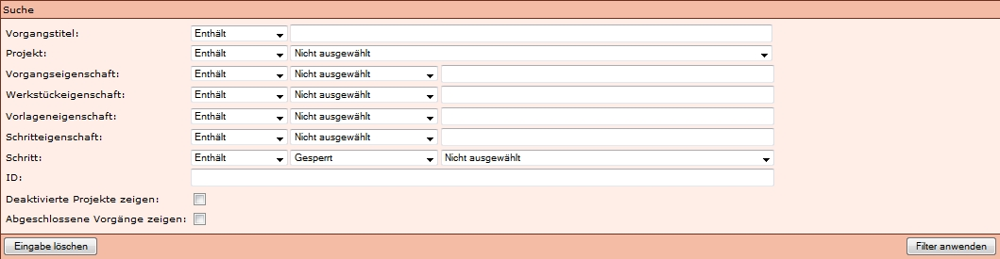

# Einleitung

In Kitodo.Production kann in einer *Suchmaske* und in dem *Suchfeld* unter *Meine Aufgaben* und *Vorgang Suchen* nach Eigenschaften der Vorgänge gesucht werden. 
Die unterschiedlichen Möglichkeiten werden auf dieser Seite erläutert. Abgeschlossen wird die Seite mit nützlichen Hinweisen zur Suche. 

# Suche mit Suchmaske

In Kitodo.Production können Vorgänge über eine *Erweiterte Suche* gesucht werden. Die unterschiedlichen Suchfelder werden in diesem Abschnitt erläutert.

*Vorgangstitel*:
In diesem Feld kann nach Bestandteilen des Vorgangstitels gesucht werden. So kann der Titel chemad_349699747-19360000 auch mit der Eingabe chemad 1936 gefunden werden.

*Projekt*:

In dieser Dropdown-Liste kann ein [Projekt](https://github.com/kitodo/kitodo-production/wiki/Projekt) ausgewählt werden, auf das die Suche beschränkt wird.

*Vorgangseigenschaft*:

In der Dropdown-Liste kann eine [Vorgangseigenschaft](https://github.com/kitodo/kitodo-production/wiki/Vorgangsdetails) ausgewählt werden, die nach dem Wert durchsucht wird, der in das Eingabefeld rechts daneben eingegeben wird.

*Werkstückeigenschaft*:

In der Dropdown-Liste kann eine [Werkstückeigenschaft ](https://github.com/kitodo/kitodo-production/wiki/Vorgangsdetails---Werkst%C3%BCckeigenschaft)ausgewählt werden, die nach dem Wert durchsucht wird, der in das Eingabefeld rechts daneben eingegeben wird.

*Vorlageneigenschaft*:

In der Dropdown-Liste kann eine [Vorlageneigenschaft](https://github.com/kitodo/kitodo-production/wiki/Vorgangsdetails---Physische-Vorlagen) ausgewählt werden, die nach dem Wert durchsucht wird, der in das Eingabefeld rechts daneben eingegeben wird.

*Schritteigenschaft*:

In der Dropdown-Liste kann eine Schritteigenschaft ausgewählt werden, die nach dem Wert durchsucht wird, der in das Eingabefeld rechts daneben eingegeben wird.

*Schritt*:

In der ersten Dropdown-Liste kann der [Status](https://github.com/kitodo/kitodo-production/wiki/Status-der-Aufgaben) ausgewählt werden, den die Aufgabe haben soll, welche in der zweiten Dropdown-Liste ausgewählt wird.

*ID*:

In das Eingabefeld kann die ID eines bestimmten Vorgangs eingegeben werden.

*Deaktivierte Projekte zeigen*:

Wird das Häkchen gesetzt, werden auch Vorgänge von deaktivierten Projekten angezeigt.

*Abgeschlossene Vorgänge zeigen*:

Wird das Häkchen gesetzt, werden auch Vorgänge angezeigt, die schon abgeschlossen ([alle Aufgaben = grün](https://github.com/kitodo/kitodo-production/wiki/Status-der-Aufgaben)) sind.

 
# Suche mit Suchbefehlen (Filter)

Auch wenn in der Version 1.10 eine Erweiterte Suche verfügbar ist, die eine Suche über eine Suchmaske ermöglicht, kann weiterhin mit Filterbefehlen unter *Meine Aufgaben* oder *Vorgänge suchen* gesucht werden.  

## Filtern nach Fortschritt des Vorgangs
### Suche nach einem Schritt:

* step:NAME
* schritt:NAME

NAME steht für den gesamten oder ein Bestandteil der Benennung des Schrittes (zum Beispiel Scan) oder auch für die Schrittnummer sein. 

### Suche nach einem Schritt in Bearbeitung:

* stepinwork:NAME
* stepinwork:Reihenfolge
* stepinwork:[START-ENDE]
* schrittinarbeit:NAME
* schrittinarbeit:Reihenfolge
* schrittinarbeit:[START-ENDE]

Dies entspricht der Statusfarbe gelb.

NAME steht für den gesamten oder ein Bestandteil der Benennung des Schrittes (zum Beispiel Scan) oder auch für die Schrittnummer sein.

### Suche nach einem geschlossenen Schritt:

* steplocked:NAME
* steplocked:Reihenfolge
* steplocked:[START-ENDE]
* schrittgesperrt:NAME
* schrittgesperrt:Reihenfolge
* schrittgesperrt:[START-ENDE]

Dies entspricht der Statusfarbe rot.

NAME steht für den gesamten oder ein Bestandteil der Benennung des Schrittes (zum Beispiel Scan) oder auch für die Schrittnummer sein.

### Suche nach einem offenen Schritt:

* stepopen:NAME
* stepopen:Reihenfolge
* stepopen:[START-ENDE]
* schrittoffen:NAME
* schrittoffen:Reihenfolge
* schrittoffen:[START-ENDE]

Dies entspricht der Statusfarbe orange.

NAME steht für den gesamten oder ein Bestandteil der Benennung des Schrittes (zum Beispiel Scan) oder auch für die Schrittnummer sein.

 
## Filtern nach Projekt
### Suche nach einem Projekt:

* project:NAME
* projekt:NAME

NAME steht für den Projektnamen oder ein Bestandteil des Projektnamens.
 
## Filtern nach Eigenschaften
### Filtern nach Angaben des Werkstücks

Für jeden Vorgang in Kitodo.Production werden Angaben des [Werkstücks](https://github.com/kitodo/kitodo-production/wiki/Vorgangsdetails---Werkst%C3%BCckeigenschaft) (Digitalisat) in der Datenbank (nicht in der Metadaten-XML-Datei) gespeichert, welche gefiltert werden können.

Angaben, die gefiltert werden können, sind:

* PPN digital
* Schrifttyp

Eine umfassende Angabe der suchbaren Daten erhält man unter "Physische Vorlagen", wenn man die [Vorgangsdetails](https://github.com/kitodo/kitodo-production/wiki/Vorgangsdetails) eines beliebigen [Vorgangs](https://github.com/kitodo/kitodo-production/wiki/Vorgang) öffnet.

Wichtig ist der Befehl, um alle Bände der zu einer Zeitschrift oder eines mehrbändigen Werks aufzulisten. Wenn mit dem Befehl die PPN digital der betreffenden Gesamtheit gesucht wird, werden alle Vorgänge, die diesen Wert in den Werkstückeigenschaften gespeichert haben, angezeigt.

Suche nach einer Werkstückeigenschaft:

* workpiece:WERT
* workpiece:NAME:WERT
* werkstück:WERT
* werkstück:NAME:WERT

NAME steht hier für die Benennung der Werkstückeigenschaft  (zum Beispiel Schrifttyp).
WERT steht hier für den zugewiesen Wert (zum Beispiel Fraktur).

### Filtern nach Angaben der Vorlage

Für jeden Vorgang in Kitodo.Production werden Angaben der [Vorlage](https://github.com/kitodo/kitodo-production/wiki/Vorgangsdetails---Physische-Vorlagen) in der Datenbank (nicht in der Metadaten-XML-Datei) gespeichert, welche gefiltert werden können.

Angaben, die gefiltert werden können, sind:

* PPN analog
* Signatur
* Titel

Eine umfassende Angabe der suchbaren Daten erhält man unter "Physische Vorlagen", wenn man die [Vorgangsdetails](https://github.com/kitodo/kitodo-production/wiki/Vorgangsdetails) eines beliebigen [Vorgangs](https://github.com/kitodo/kitodo-production/wiki/Vorgang) öffnet.

Sind zum Beispiel in der Signatur Leerzeichen enthalten, muss der Suchterm (inklusive Befehl) in Anführungszeichen gesetzt werden.

"vorlage:Z. 4. 2219-1940"

Suche nach einer Vorlageneigenschaft:

* template:WERT
* template:NAME:WERT
* vorlage:WERT
* vorlage:NAME:WERT

NAME steht hier für die Benennung der Vorlageneigenschaft  (zum Beispiel Signatur).
WERT steht hier für den zugewiesen Wert (zum Beispiel Hist.Sax.H.1390-1900).

### Suche nach Prozesseigenschaft:

Dies bezieht sich auf eine neue Kategorie in den Vorgangsdetails "Eigenschaften", neben den bestehenden Kategorien "Physische Vorlagen" und "Werkstücke".

In der Suchmaske kann diese Kategorie unter dem Feld "Vorgangseigenschaft" durchsucht werden.

Angaben, die gefiltert werden können, sind:

* digitalCollection
* Template
* TemplateID

Suche nach einer Eigenschaft:

* processproperty:WERT
* processproperty:NAME:WERT
* prozesseigenschaft:WERT
* prozesseigenschaft:NAME:WERT

NAME steht hier für die Benennung der Eigenschaft  (zum Beispiel Template).
WERT steht hier für den zugewiesen Wert (zum Beispiel DigislubM_OCR).

### Suche nach Schritteigenschaft

Dies bezieht sich auf die Inhalte in der "Nachrichtenbox" unter Vorgangsdetails.

In der Suchmaske kann diese Kategorie unter dem Feld "Schritteigenschaft" durchsucht werden.

Angaben, die gefiltert werden können, sind:

* Korrektur durchgeführt
* Korrektur notwendig

Suche nach einer Schritteigenschaft (Dies scheint sich auf die Inhalte in der "Nachrichtenbox" unter Vorgangsdetails zu beziehen):

* stepproperty:WERT
* stepproperty:NAME:WERT
* schritteigenschaft:WERT
* schritteigenschaft:NAME:WERT

 
## Filtern nach ID-Nummern

Suche nach einem Identifier:

* id:WERT

WERT steht hier für die ID.

 
## Suche nach einem Prozess:
Suche nach einem Prozess:

* process:NAME
* prozess:NAME

 
# Nützliche Hinweise
## Suche nach mehreren IDs

Wenn mehrere Vorgänge gleichzeitig bearbeitet werden sollen (zum Beispiel Hochsetzen,...), können mehrere IDs gleichzeitig gesucht werden.

*Suchmaske*:

In der Suchmaske können einfach mehrere IDs in das Feld *ID* eingegeben werden.

*Filter*:

Wenn in dem Filter-Feld unter *Meine Aufgaben* oder *Vorgang suchen* nach mehreren IDs gesucht wird, muss der ganze Befehl in Anführungszeichen gesetzt werden:

"id:85200 85211 85212 85213 85214 85215 79010 85217 82737 85792 85308 83928 84312 84522 80491"

## Ausschließende Suche

Es ist auch möglich, Vorgänge mit bestimmten Inhalten des Vorgangstitels aus der Treffermenge auszuschließen.

Bei Zeitschriften können so anhand der Bandangabe bestimmte Bände ausgeschlossen werden.

Zum Beispiel werden bei der Suche *PPN:XXXXX 185* alle Bände der PPN XXXXX der 1850er Jahre aufgelistet. Wenn jedoch der Band 1855 nicht in der Trefferliste angezeigt werden soll, kann dies mit "-1855" umgesetzt werden. Letztendlich kann ein Suchbefehl so formuliert sein: "*PPN:XXXXX 185 -1855*"

# Weitere Informationen
Tutorial: [Statistik](https://github.com/kitodo/kitodo-tutorials/blob/master/kitodo2/10_statistik.md)