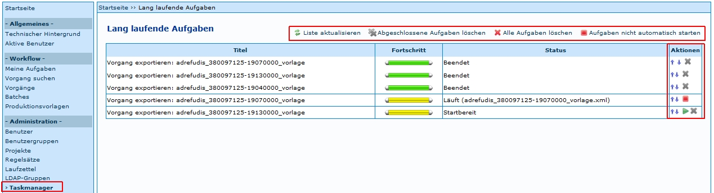

# Einleitung
Der Taskmanager in Kitodo.Production bearbeitet asynchrone oder langlaufende Aufgaben, um andere Arbeiten in Kitodo.Production nicht zu blockieren. 

Dies sind zum Beispiel der automatische Export, das Auslösen des OCR-Scripts oder das Anlegen von Zeitungsvorgängen mit dem Zeitungsmodul. Die  Aufgaben des Taskmanagers werden von jeder Einrichtung definiert, so dass hier nur eine allgemeine Einführung formuliert wird.  

# Aufbau
Der Taskmanager besteht aus einer Tabelle mit folgenden Spalten: 

* Titel
* Fortschritt
* Status
* Aktionen

Zudem werden über der Tabelle noch vier Funktionen angeboten: 

* Liste aktualisieren
* Abgeschlossenen Aufgaben löschen 
* Alle Aufgaben löschen 
* Aufgaben nicht automatisch starten

# Informationen
*Titel* 

In dieser Spalte wird angegeben, welche welche Aktion (zum Beispiel *Vorgang exportieren*) mit welchem Vorgnag durchgeführt wird. 

*Fortschritt*

In dieser Spalte wird der Prozessstatus der Aktion angezeigt (grün = Beendet, gelb = Startbereit oder Läuft). 

*Status*

In dieser Spalte wird der Prozessstatus verbal beschrieben. 

*Aktionen*

Die Aktionen in dieser Spalte bieten folgende Möglichkeiten 

* einen Prozess zu starten 
* abgeschlossene Aufgaben zu löschen
* Änderung der Reihenfolge der Bearbeitung 

# Funktionen
Über die Konfigurationsdatei kann Einfluss auf einige Eigenchaften des Taskmanagers genommen werden: 

* Anzahl der parallel laufenden Aufgaben 
* Wie oft die Übersicht aktualisiert werden soll
* Anzahl der vorgehaltenen fehlgeschlagenen / erfolgreiche Aufgaben (genutzte Ressourcen werden solange nicht wieder freigegeben, jeweils getrennt konfiguriert)
* Dauer der vorgehalten fehlgeschlagene / erfolgreiche Aufgaben (genutzte Ressourcen werden solange nicht wieder freigegeben, jeweils getrennt konfiguriert)
* Ob der Taskmanager in der Kitodo.Production-Übersicht angezeigt werden soll. Er läuft unabhängig davon permanent.

Der Taskmanager ist zum Teil in der [Zeutschel Dokumentation](http://www.goobi.org/fileadmin/groups/goobi/dokumentation/TS-1105_Weiterentwicklungen-GOOBI-WLB.pdf) (Punkt 2.1 DMS-Export als langlaufende Aufgabe) beschrieben.
